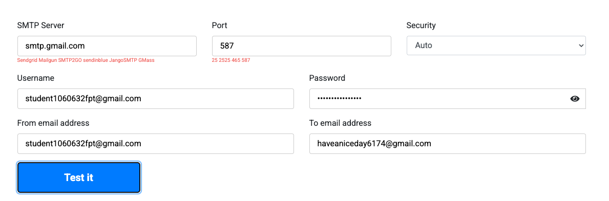
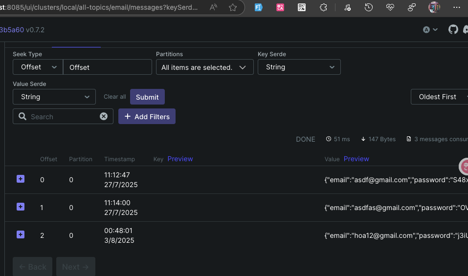
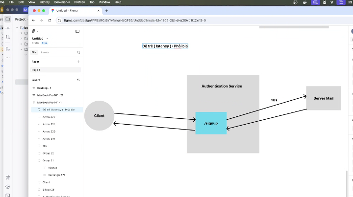
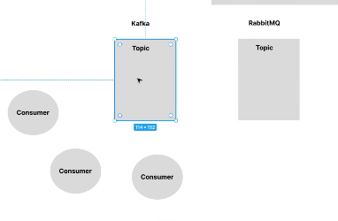
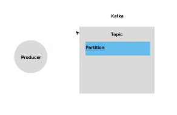
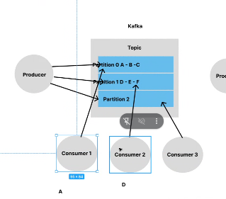
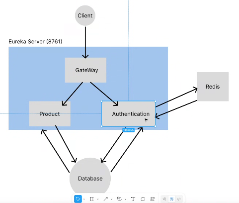
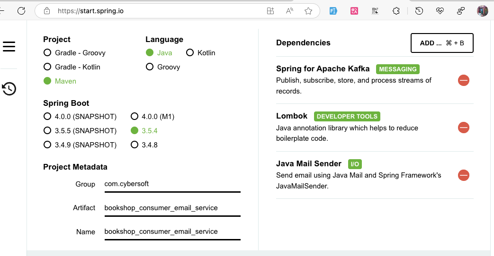
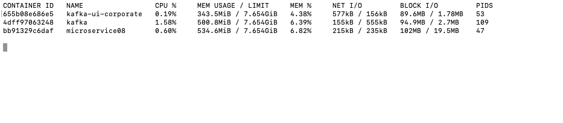
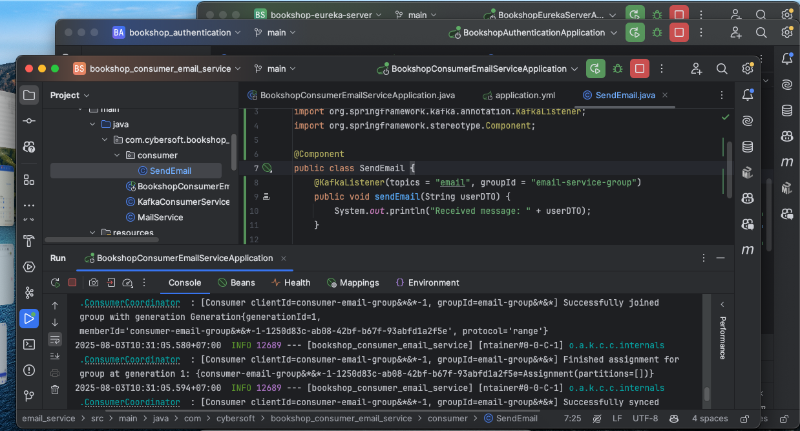

thông tin
```
smtp.gmail.com
587
student1060632fpt@gmail.com
iazwahsoqeatftrx
haveaniceday6174@gmail.com
```

```xml
    <dependency>
      <groupId>org.springframework.boot</groupId>
      <artifactId>spring-boot-starter-mail</artifactId>
    </dependency>
```



# buổi 10 hôm nay


- latency; phải biết cái này mới xử lý được bất động bộ
- latency là bao nhiêu
- thực ra cũng ko cần nhưng nó có liên quann: data có cần nhận kết quả ngay lập tức ko
- latency thường xảy ra khi giao tiếp với hệ thống khác thui
- đến khúc này sẽ biết tại sao xài kafka chứ ko xài quêue khác
- có tình trạng xảy ra có user đk được có user ko đk được vì càng nhìu user đk càng lag
- mỗi giây 1 user đk, mà khả năng fail 15% thì còn có 350 ngừoi đk, ko đáng
- vì ko cần đk có dùng mail liền nen ecos thể dùng thằng queue để xử lý sau
- đã xử lý bất đồng bộ thì có thể sử dụng hệ thống queue
- queue: kafka, Rabbit MQ, Active MQ
- cái rabbitmq nó setup nhanh hơn, 2 cái kafka và rabbit đều có clutter lun rùi

- cơ chế kafka, để lưu trữ data sẽ lưu zô topic, thằng Rabitmq cũng lưu vào topic, kafka vừa xử lý tuần tự được mà vừa xử lý bất đồng bộ nằm trỏng lun,

- cơ chế của queue là mình có nhìu con consumer


- partition: giống lưu trữ ổ D ổ E chia ổ đồ đó, trong việc mình setup kafka mình sẽ quyết định số lượng của cục trong partition
- bản chất kafka khi mình ko giới hạn cái partition lưu bao nhiêu thì kafka nó sẽ sử dụng cơ chế xoay vòng, nó sẽ lưuu cho đến khi nào nó lưu hết mấy cái partition này thì thôi - round robin
- bản chất khi mấy con cónumer sẽ đến lấy đúng data bên trong partition cụ thể, nó lấy theo partition 0
- ví dụ:  A trong partition 0, B trong partition 1, C trong partition 2


- vậy nên thằng kafka nó ko lấy theo thứ tự, nó cứ lấy độc lập với nhau được

- còn nếu data lấy rabit thì nó rõ ràng sẽ theo thứ tự đồng bộ hơn
- thêm 1 cục source consumer để giải quyết vấn đề bất động bộ với kafka


- tuỳ vào nghiệp vụ có cần lưu trữ database hay ko, thì trường hợp này ông khách cần phải lưu 



pentest --> 24 gb


- chayj cicd 8->10gb
- pentest scan code scan dependency: 1->2gb
- gitlab bị cái hết ram ko chạy nữa, mà lúc đó mình lại start 

```
docker stats
```



```java
@Configuration
public class EmailConfig {
    @Value("${email.host}")
    private String host;

    @Value("${email.port}")
    private int port;

    @Value("${email.username}")
    private String username;

    @Value("${email.password}")
    private String password;

    @Value("${email.auth}")
    private boolean auth;

    @Value("${email.starttls}")
    private boolean starttls;

    @Value("${email.debug}")
    private boolean debug;

    @Value("${email.protocol}")
    private String protocol;

    @Bean
    public JavaMailSender getJavaMailSender() {
        JavaMailSenderImpl mailSender = new JavaMailSenderImpl();

        // Configure host, port, and credentials

        mailSender.setHost(host);
        mailSender.setPort(port);
        mailSender.setUsername(username);
        mailSender.setPassword(password); // Use an App Password if using Gmail

        // Configure additional mail properties
        Properties props = mailSender.getJavaMailProperties();
        props.put("mail.transport.protocol", protocol);
        props.put("mail.smtp.auth", auth);
        props.put("mail.smtp.starttls.enable", starttls);
        props.put("mail.debug", debug);

        return mailSender;
    }


}
```
- cái source này anh bình dùng setup 2 mail nội bộ và mail công khai



cái group này trong kafka nó còn có khái niệm khác nữa nhơs tự tìm hiểu

## btvn
- group id trong kafka
- còn có luồng retry và dead 
- thay vì gửi cứng 
- sau này mình làm ott, push notification

## buổi sau
- buổi sau khi ngừoi ta đăng kí lần đầu tiên người ta bắt buộc người ta đổi mật khẩu, buổi sau
- logic 1 làm cách nào đổi mật khẩu
- logic 2 làm cơ chế ko cho phép đăng nhập quá 5 lần mật khẩu gần nhất

- nhớ phải chạy lại redis cho được