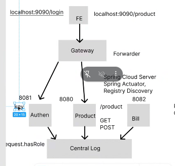
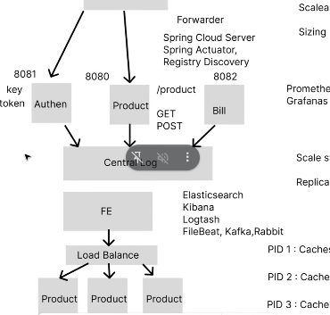

# buổi 11
- đặt skill lên đầu xong rồi mới tới edu & ex
- bổ sung thêm gateway, eureka server, xong người ta hỏi gateway dạng nào, xài gì, biết gì về gateway, mình dùng spring cloud gateway, 
- về kafka mình đã học được 70% rồi, người ta ko hỏi về triển khai server đâu vì họ bít mình chưa triển khai


- phân quyền nằm trong cục nào?
    - nếu mình đặt trong service, thì phân quyền mình lấy ở đâu ra, lúc này phải tự viết một cục filter lấy token về dùng token đó giải mã rồi dùng quyền đó xét chứng thực rồi mới đi được
      - khi mình đăng nhập thì cần 1 cái key để parse ra token, vậy nên 100 thằng service cũng 100 thằng filter xài chung cái key
    - đặt trong gateway, ảnh tính chỉ authen 2 server OAuth 2, 

- gateway đang cần role, quyền, quyền đó làm sao lấy, lấy ntn
  - cũng lưu cái key vô trong gateway, gateway lấy key parse token ra được quyền hiện tại
  - ví dụ hệ thống có ông nhân viên với ông admin, 2 ông cùng xài chung 1 token, 2 ông lấy 



- cái vụ mà .env chia môi trường product, 
- xong cái nếu chatgpt hỏi nhiều nó loãng, bắt nó đưa full example
- vụ get role, khi để key trong con gateway, phải restart con gateway, mà nó xài liên server
    - sai định nghĩa gateway, vì nó chỉ nên là và chỉ nên là forwarder, 
- sso single sign on đăng nhập 1 nơi và chứng thực được tất cả, để con authen thành center authen gateway


- load balancer: cân bằng tải, giảm tải cho cục source = cách replica 1 ví dụ, nó phải replicate nhiều cực source lên, nó sẽ 5 user đầu chạy cục source 1, key 
  - lúc này nhân đôi ra key với token nó như nhau
  - vậy nên khi cân bằng tải, ngừoi ta hông cho dùng session vì cái 1 thì lưu session để làm caching, cái 
  - đỡ nói về việc authen true


- hỏi a bình về việc làm quài ko xong nổi dự án, nó bị ngợp quá
- mún bác giải pháp của người ta
  - 1 hiểu giải pháp ngừoi ta, phải nghe kĩ lưỡng và hiểu cái ngừoi ta
  - phân tích ưu nhược điểm trong đầu, cái của mình nhược điểm là gì, ưu điểm là gì, hơn của người ta ưu điểm gì, nhược điểm của mình thua ngừoi ta cái gì
  - sau đó hẳn phản biện

- khi mà học xong, tuần sau dùng cái authen 2 nó cũng y chang nhưng thư viẹn hỗ trợ, quá đỡ làm tay, con keycloak đảm nhận 2 chức năng lun

- latency, ngừoi ta mún làm, gateway đẩy zô keycloak, vì thằng này 


- project mono microservice, còn này là dynamic flexible, 

- Con gateway đón nhận vai trò xét quyền, zụ set quyền do mình xài secủity, nên quyền mình lưu trữ trong token, vậy nên nó bị trễ vài giây latency

- giờ mình thực hành lun

- mở 

```sql
USE bookstore;
CREATE TABLE roles(
	id int auto_increment,
	name varchar(50),
	createDate TIMESTAMP default CURRENT_TIMESTAMP(),
	
	primary key(id)
)

```

```sql
USE bookstore;
CREATE TABLE roles(
	id int auto_increment,
	name varchar(50),
	create_date TIMESTAMP DEFAULT CURRENT_TIMESTAMP,
	
	primary key(id)
),

ALTER TABLE users ADD COLUMN role_id int; 
ALTER TABLE users ADD CONSTRAINT FK_role_id_users
FOREIGN KEY(role_id) REFERENCES roles(id);
```

# buwax sau
xử lý gateway, call qua authen lấy cái quyền như nào, xong làm sao phân quyền cho cái product, 


- bữa sau nữa, xây dựng central log mất 2-3 buổi
- bổ sung mấy cái mã hoá bảo mật zô
