# buổi 13 

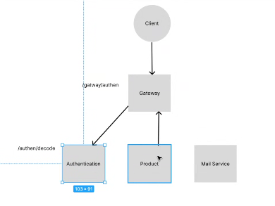

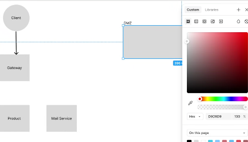

vùng dmz là nơi triển khai những ứng dụng cho phép đi ra môi trường internet, là nơi mình triển khai ứng dụng cho phép gọi vào ấy, dmz là tên gọi của cấu hình mạng máy tính. 

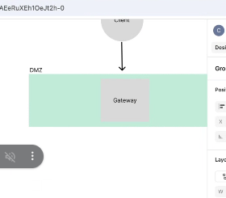

mấy cái client này đặt vô phân vùng dmz, 
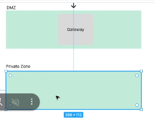

sau này đặt cái cấu hình private zone, nó rộng lắm nó sẽ chỉ có mỗi mấy cái mình cần dấu ở trong này thôi, nguyên tắc mạng của mình chỉ có 1 chiều, vùng dmz này chỉ có đi zô chứ ko đi ra
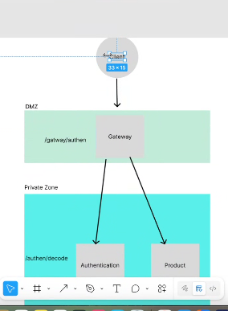

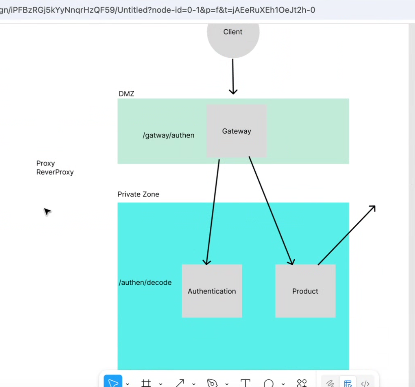

Cái product mún gọi ra ngoài phải gọi ra proxy và reverse proxy
- Reverse proxy là quản lý đường mạng đi vào
- proxu đi ra
- ngĩnx là dạng revert proxy

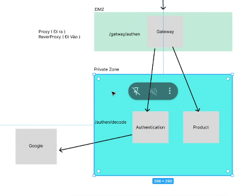
source này cosi gì thằng parrent méo bít

- prevẻt proxy, kiểu anh chặn đường đi vào
- proxy chặn đường đi ra
- private zone là phân vùng ko đc phép đi ra

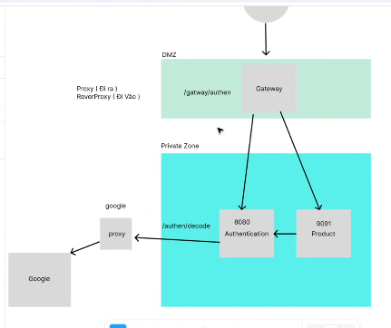

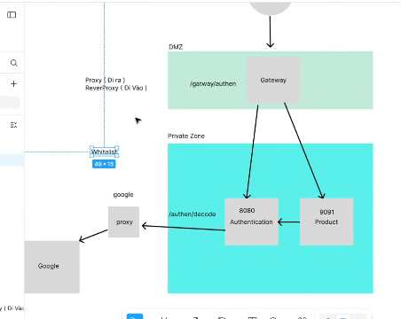
- google nó giống cái thirdparty thôi mà
- vậy nên sau này nó có cái giống như whitelist, và 1 cái nữa

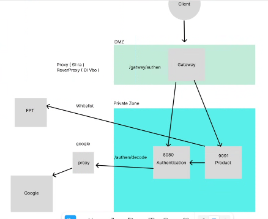

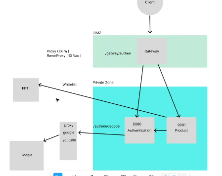

- khi nào dùng whitelist khi nào dùng proxy trong spring boot?
- ưhitelít rủi ro hơn proxy, whitelist là khi làm với 3p, nó có kí hợp đồng với mình, thì mình xài whitelist, vì trong hợp đồng đó có ràng buộc trách nhiệm khi rủi ro xảy ra.
- Mình xài proxy khi cái 3pd đó ko kiểm xoát đc, nó sẽ phải có đội ngũ it đi kiểm tra, 

- buổi sau:
+ học rsa, mã hoá dữ liệu, 
+ xong đi qua central log