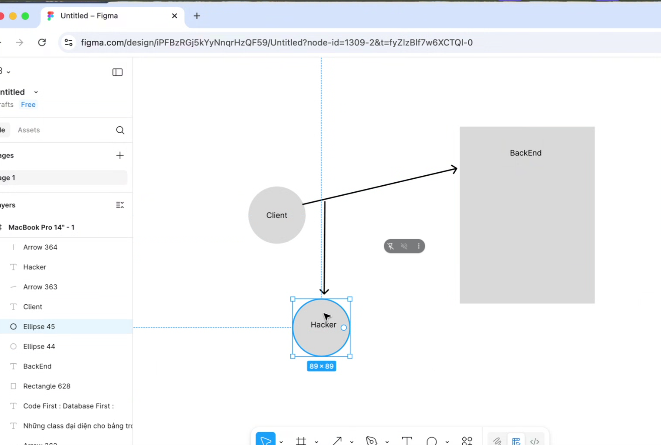
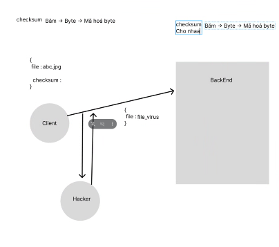
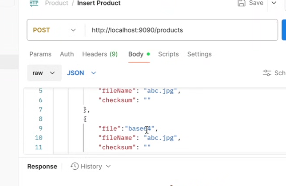
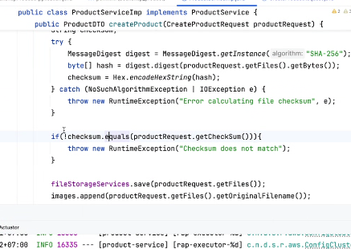

# Buoori 14


- checksum cho file gửi điđi

- back end nhận được cũng phải checksum cho file nhận được

- so sánh với file backend truyền lên
- checksum gửi đi so sanhs với checksum nhận được

- nó dùng md5, cái chuẩn mã hoá cùi nhất, vẫn bị tình trạng hacker nó có kiêns thức backend & front-end và cơ chế checksum thì nó vẫn tìm được.

```java
@Getter
@Setter
public class CreateProductRequest {
    private String title;
    private String author;
    private int review;
    private double price;
    private MultipartFile[] files;
    private String checkSum;
}
```


- giả sử có cái multipart file thì bây giờ checksum sao
- a: chuỗi checksum 1
- b: chuỗi checksum 2
- checksum lỡ file nào đi trước file nào đi sau thì sao, khi nào upload nhìu file thì người ta xài base64, vậy nên người ta chuyển về kiểu raw json


nên ngừoi ta để raw json như này
- rủi ro json bị, ko phải rủi ro, nhưng cái rủi ro json bị dài quá, ko đês nổi
- xài md5 bị mã hoá 2 chiều
- còn sha1 chỉ mã hoá 1 chiều



- neeus ko có checksum quét pentest nó sẽ báo bắt sửa lại hà
- [sha 125](https://l.facebook.com/l.php?u=https%3A%2F%2Femn178.github.io%2Fonline-tools%2Fsha256_checksum.html%3Ffbclid%3DIwZXh0bgNhZW0CMTEAAR6CGT5fJ98BzVW04SioMzQL7Guf5Yhob1thNFXnX_my0y1qyKayIIclmnQHLg_aem_xSuwh7DCT7__BIeJF6qnhw&h=AT3gBtwFRtaEL-mVBP0ebJYfOQuGHm_pC_MJSjuJs90SGq-kxdpFlJBlejnr6AoJgoEn-Urv5djd_mvtXd-lOoiFVEQlsWKS6L7TVIGHixNSyKDOlABGWRBYEGH2qWM&s=1)


- khi mình trả lời mà mình có xen lẫn kĩ thuật cách làm vào dễ bị hỏi xoáy
khi mình gửi data có file lên, hacker sẽ bắt đc gói tin nên nó can thiệp, chỉnh sửa file, nó đưa virús zô, backend mình ko nhận dạng được, nên cần có 1 cái verìfy chính là checksum

- nên thằng fe gửi file gửi kèm chuỗi hask checksum, nên backend sẽ nhận file mã hoá bằng mã hash bằng thuật toán tương tự, nếu giống nhau thì đúng file, ko thì ko nhận file

- vấn đề khi checksum cho nhiều file, front-end gửi mảng file a,b,c,. Nhưng khi họ làm thuật toán checksum, họ phải phân giải 3 file này về kiểu byte, file a và b và c, nhưng khi truyền file trên môi trường mạng, nó sẽ nhẹ đi trước nặng đi sau
- có cách đó chính là mảng file đc sắp xếp
- khi mình làm chuỗi json mình truyền file lên
```json
[
    {
        "fileName": "abc.jpg",
        "file": "chuyển về dạng base64",
        "checksum": ""
    },
    {
        "fileName": "abcd.jpg",
        "file": "chuyển về dạng base64",
        "checksum": ""
    }
]
```
- json rõ ràng mạch tường minh, nhưng base64 nặng hơn 1.5 lần kích thước thật, là cái chuỗi có kích thuơcs nặng thôi chứ khi biến nó về file nó sẽ chỉ vẫn là 20mb thôi, nó chỉ đọc gb lâu hơn do băng thông nó có chừng đó thui, nó sẽ bóp băng thông lại, có buffer, nó sẽ ko sợ vấn đề băng thông, nó chỉ đọc gb chậm thui

