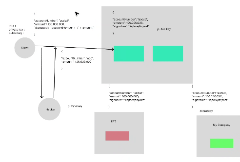

# buổi 16
- kiểu cần 1 người dẫn dắt công nghệ mới áp dụng có phù hợp hông, suy nghĩ của mình có phù hợp hông, cần có người phản biện, liệu có nên đưa công nghệ này vào ko
- cơ chế checksum giúp mình an toàn data theo file upload
- nhưng ở cty đòi hỏi bảo mật cao hơn

- nội dung client gửi và nội dung server nhận có giống nhau ko?
- ngoài việc bảo mật file mình gửi và nhận giống nhau, thì lúc này ở các api đòi hỏi quyền bảo mật cao, tiền ra tiền vào đồ đó, thì lúc này họ càng iu cầu tính toàn vẹn về mặt dữ liệu. Lúc này ngừi ta mún đảm bảo bảo mật hơn:
  - lúc này có thể dùng checksum, nhưng chekcusm ko bảo mật lứm,
  - signature là ký số
    - có thể xài cơ chế secret key, signature có cái key để mã hoá là được



- xoay vòng key, mỗi public key sinh ra trong 1 năm phải có expired date, nó sẽ phải tạo private key mới
- zero downtime deployment, khi mình triẻn khai thời gian off bằng 0 
- revert proxy, thêm, hoặc trước khi qua gateway, hoặc load balancer, phải tìm hiểu load balancer và revert proxy nữa thì mới làm được cái zụ server sập
- anh Bình đã cố gắng tự đọc source tự hiểu bussiness, và tự build cái đống source sao cho nó tự chạy được, xong tự nhảy hết từ chỗ này qua chỗ kia toàn vị trí khó để hiểu hết cái bussiness, phải tự dựng tự chạy và hiểu hết toàn bộ

- cách hỏi chatgpt: tôi dùng máy mac, tôi mún xài cơ chế signature để verify data, hãy hướng dẫn tôi chi tiết step by step cách tạo key

- có khả năng hỏi cặp key này của a sinh ra từ thuật toán nào vậy, tức mình có làm đúng rule, đúng hết lun, public key đúng lun nhưng sai thuật toán verify, mình cần phải giải thích thuật toán xài để sinh key là thuật toán nào nữa cơ.

```cmd
private key (PKCS#8)
openssl genpkey -algorithm RSA -out private.pem -pkeyopt rsa_keygen_bits:2048

public key (X.509 PEM)
openssl rsa -in private.pem -pubout -out public.pem
```

- tui để trong folder microservice --> gen key

- anh Bình đưa code để giải mã key
```java
import java.security.*;
import java.security.spec.*;
import java.util.Base64;
import javax.crypto.Mac;
import javax.crypto.spec.SecretKeySpec;
import java.nio.charset.StandardCharsets;

public class SignatureUtils {
    public static PrivateKey loadPrivateKeyPem(String pem, String algorithm) throws Exception {
        String normalized = pem.replaceAll("-----BEGIN (.*)-----", "")
                              .replaceAll("-----END (.*)-----", "")
                              .replaceAll("\\s+","");
        byte[] keyBytes = Base64.getDecoder().decode(normalized);
        PKCS8EncodedKeySpec spec = new PKCS8EncodedKeySpec(keyBytes);
        KeyFactory kf = KeyFactory.getInstance(algorithm);
        return kf.generatePrivate(spec);
    }

    public static PublicKey loadPublicKeyPem(String pem, String algorithm) throws Exception {
        String normalized = pem.replaceAll("-----BEGIN (.*)-----", "")
                              .replaceAll("-----END (.*)-----", "")
                              .replaceAll("\\s+","");
        byte[] keyBytes = Base64.getDecoder().decode(normalized);
        X509EncodedKeySpec spec = new X509EncodedKeySpec(keyBytes);
        KeyFactory kf = KeyFactory.getInstance(algorithm);
        return kf.generatePublic(spec);
    }

    public static String signWithPrivateKey(PrivateKey privateKey, byte[] data) throws Exception {
        Signature sig = Signature.getInstance("SHA256withRSA"); // or SHA256withECDSA
        sig.initSign(privateKey);
        sig.update(data);
        return Base64.getEncoder().encodeToString(sig.sign());
    }

    public static boolean verifyWithPublicKey(PublicKey publicKey, byte[] data, byte[] signature) throws Exception {
        Signature sig = Signature.getInstance("SHA256withRSA");
        sig.initVerify(publicKey);
        sig.update(data);
        return sig.verify(signature);
    }

    public static String hmacSha256Base64(String secret, byte[] data) throws Exception {
        Mac mac = Mac.getInstance("HmacSHA256");
        mac.init(new SecretKeySpec(secret.getBytes(StandardCharsets.UTF_8), "HmacSHA256"));
        return Base64.getEncoder().encodeToString(mac.doFinal(data));
    }

    public static byte[] sha256(byte[] data) throws Exception {
        MessageDigest md = MessageDigest.getInstance("SHA-256");
        return md.digest(data);
    }
}
```

- grpc  nó là loại giao tiếp đc truyền trực tiếp giữa server vz server, thay vì trả data json đc đóng gói trong file, và truyền file đó đi, nên nó sẽ chậm, nhưng giờ nó mún truyền data trực tiếp lun, ví dụ format kiểu int thì bên kia nhận đc kiểu int lun