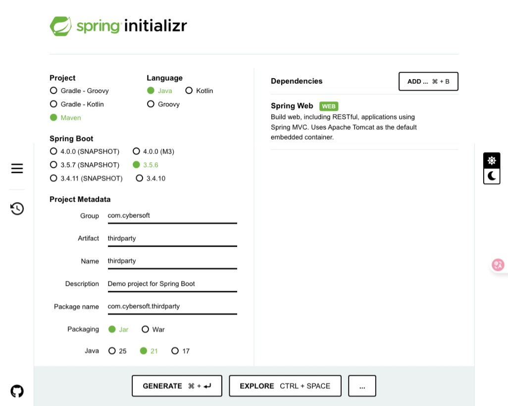

# buổi 17
- học cái cuốn sách pmp, nó kể cho mình nghe nhiều trường hợp lắm
  những key này đặt rule có giá trị, nhưng tránh cái rule quá đơn giản, nên chèn vào bằng buổi hardcode 

  
  
  - tạo repo mới lun
  - https://github.com/hoa-nguyen-bk/bookshop_thirdparty

# hashicorp vault
localhost:8080/3rd xong cái ni lưu 
```java
 PublicKey publicKey = SignatureUtils.loadPublicKeyFromResource("public.pem","SHA256withRSA");
            // taị mình làm với base 64
            boolean varified = SignatureUtils.verifyWithPublicKeyBase64(publicKey,"a".getBytes(StandardCharsets.UTF_8),signature,"SHA256withRSA");
            return signature + " - " + varified;
```
xong tesst coi nó ra true hay false, true thì oki, false thì sai, ko sinh ra
- thằng giữ public key cần cái rules, là chính mình, là chính product controller, thằng quy định rules là thằng giữ public key, nếu ko cứ vnpt gọi tới, fpt gọi tới, biết đầu mà lần. Cái signatủe được sinh ra từ title, author và price. Title "@" + " author + "___"price"+

- xong nhớ kiểm tra cái biến varify = false hay true, cái này quan trọng lắm
- xong demo liên quan đến signature, tính toàn vẹn về data, chỉ đảm bảo toàn vẹn khi data cho third party sử dụng, mình là người tự định nghĩa 
- ví dụ cái thirdparty đụnh nghãi ra, tính hết rule nhen, cái third party gọi qua controller 

# bữa sau:
- qua chuẩn mã hoá hybrid, chuẩn mã hoá deepweb nó là chuẩn mã hoá hybrid, hoặc PCP tuỳ mình
- ôn lại cái logic nha
- 