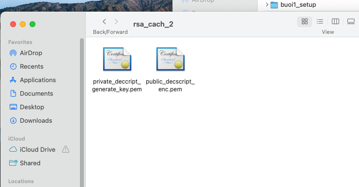

## buổi 18
- cty mà có sen mà có middle thì mình đã là middle nên nó nghĩ mình tự hiểu, nên có thể mình phải tự học.
- hmac
  - mỗi client 1 hashmap, 1
- bài toán làm tăng tốc độ xử lý, concurrence user nhiều user như vâỵ thực hiện 1 giao dichj làm sao tăng tốc độ xử lý và scale lên
  - mình xài kafka tăng consumer lên sẽ tăng tốc độ xử lý

- dùng rsa làm signature thì private key có công dụng gì, publish key có công dụng gì
  - privatey -> tạo signature , public key -> veryfy xem thử data đó có chính là từ private key sinh ra hay ko
  - private key là sẽ tạo còn public key là verify
  - bây giờ có một số giao dichj đặt biệt tình huống đặc biệt, nhu cầu bảo mật cao hơn, khi giao tiếp backend client vz nhau, dùng signature sẽ làm lộ thông tin khách hàng
  - customer id là cmnd khách hàng, sau đó là sđt
```json
{
    "cmnd": 0909090,
    "sdt": 0909090,
    "diachi": 090909, //để tăng tính bảo mật sẽ có signature ở đây
    "maThe": 090909,
    "ccv": 255,
    "signature": "ababab"
}
```

- giờ nó ko cần đổi địa chỉ nữa nó chỉ cần thông tin khách hàng thôi, 
- nên họ cần khi gửi những data nhạy cảm gồm tt khách, tham số thẻ, thì nó mún mã hoá toàn bộ data nhạy cảm này 
- nếu mình làm md5 đơn thuần thì cũng bị lộ
- vậy nên ứng vz mỗi client họ sẽ lưu 1 hmac, họ sẽ lấy cái hmac của client ra lưu vào, client đăng nhập lấy cái hmac là xong, client bắt buộc phải lưu trữ cái hmac ở phía client
- hmac lưu trong database
```json
{
    "cmnd": "hmac",
    "sdt": "hmac",
    "diachi": "hmac",
    "maThe": "hmac",
    "ccv": "hmac",
    "signature": "hmac"
}
```
- người ta mún che hết càr chuổi luôn
- tình hún thứ 2 của signature, mã hoá và giải mã,
- nó mã hoá hết cả chuỗi luôn
```json
    "hmac"
```

- chỉ xài cho data siu nhạy cảm
- tụi bảo mật sẽ đánh giá cái nào data quan trọng cái nào cần mã hoá và quy định cho mình làm, có khi nó chả biết gì cả và backend tự làm hết lun
- chức năng thứ 2 của rsa là mã hoá và giải mã,
- Chức năng 1 của rsa là mã hoá và verify
- xài theo cơ chế mã hoá sẽ ngược lại:
  - lúc này backend sẽ là người giữ privatekey
  - lúc này publish key sẽ giữ 1 chức năng dùng để mã hoá


- **chức năng thứ 2 thì private key dùng để giải mã, publish key dùng để mã hoá**
- sinh key

```
private key (PKCS#8)
openssl genpkey -algorithm RSA -out private.pem -pkeyopt rsa_keygen_bits:2048

public key (X.509 PEM)
openssl rsa -in private.pem -pubout -out public.pem
```


- demo tình huống api nhận vào tình huống ghi thẻ ccv vô
- senior hay hỏi về thiết kế hệ thống system design
- senior hay hỏi về scale system
- anh bình đang học đánh giá hệ thống 

## bữa sau học:
- hybrid giải thích ý nghĩa
- sau đó qua central log
