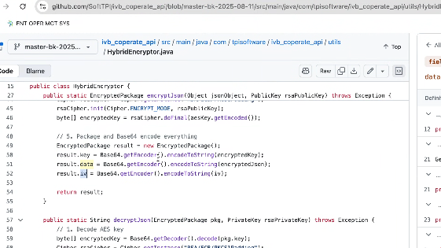
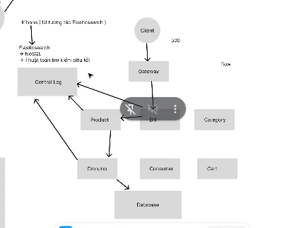
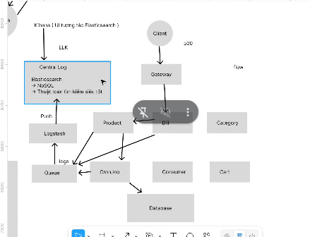

# buổi 19
bubuổi- nhược điểm của rsa là ko mã hoá dung lượng lớn đc> 512byte nên mình xài đc, còn nếu đưa hình ảnh lên nó sẽ rất lớn, có khi lớn hơn 512byte luôn, một cái ảnh là lên tới kb luôn nên nó sẽ ko mã hoá được
- rsa nó còn chậm nữa, nên nó sẽ xài chuẩn hybridh
- Nên mình dùng thuật toán AES, nên mình dùng thuật toán mã hoá dữ liệu rất nhỏ luôn, nên bên ngoài người ta dùng hyhybhyhhyhhyhy
- hybrid = AES + RSA
- Chuỗi --> EAS --> mã hoá lần nữa ra RSA, rồi mới gửi RSA này cho clientclient
- Chuỗi mã hoá EAS: nó sẽ tự động random một cái keyk, nó sẽ mã hoá data của mình, ra được data đã được mã hoá theo chuẩn EAS cộng với key mã hoá data đó --> RSA (mã hoá cả data EAS + key này, nó là EAS key)
- phỏng vấn senior nó sẽ hỏi mình cái nàynày
- đonaj code này nè:
```java
 // ===================== HYBRID (RSA + AES-GCM) =====================

    /**
     * Hybrid encrypt: generate AES key, encrypt plaintext with AES-GCM, encrypt AES key with RSA-OAEP.
     * Returns a String: "hybrid:<encKeyBase64>.<ivBase64>.<ciphertextBase64>"
     *
     * Note: RSA can only encrypt small data (size < keySizeBytes - overhead). We only encrypt the AES key.
     */
    public static String hybridEncrypt(PublicKey rsaPublicKey, byte[] plaintext, byte[] associatedData) throws Exception {
        // 1) generate AES key (256 bits recommended)
        byte[] aesKey;
        try {
            aesKey = generateAesKey(256);
        } catch (NoSuchAlgorithmException e) {
            // fallback to 128 if 256 not allowed
            aesKey = generateAesKey(128);
        }

        // 2) encrypt plaintext with AES-GCM
        String ivAndCiphertext = encryptAesGcm(aesKey, plaintext, associatedData); // returns iv.ct

        // 3) encrypt AES key with RSA-OAEP
        byte[] encKey = rsaEncryptOaep(rsaPublicKey, aesKey);

        String encKeyB64 = Base64.getEncoder().encodeToString(encKey);
        // ivAndCiphertext already in form ivB64.ctB64
        return "hybrid:" + encKeyB64 + "." + ivAndCiphertext;
    }

    /**
     * Hybrid decrypt: input the hybrid string returned by hybridEncrypt.
     * Returns decrypted plaintext bytes.
     */
    public static byte[] hybridDecrypt(PrivateKey rsaPrivateKey, String hybridInput, byte[] associatedData) throws Exception {
        if (!hybridInput.startsWith("hybrid:")) {
            throw new IllegalArgumentException("Invalid hybrid format");
        }
        String payload = hybridInput.substring("hybrid:".length());
        // first part is encKeyB64, remaining is iv.ct (where iv and ct separated by '.')
        int firstDot = payload.indexOf('.');
        if (firstDot <= 0) throw new IllegalArgumentException("Invalid hybrid payload");

        String encKeyB64 = payload.substring(0, firstDot);
        String rest = payload.substring(firstDot + 1); // iv.ct

        byte[] encKey = Base64.getDecoder().decode(encKeyB64);
        // decrypt AES key with RSA
        byte[] aesKey = rsaDecryptOaep(rsaPrivateKey, encKey);

        // decrypt AES-GCM payload
        return decryptAesGcm(aesKey, rest, associatedData);
    }

```
- đoạn code này đây
```json
{
    "dataAES encrypte": "abc",
    "rsa chỉ mã hoá AES key": "" 
}
```
- tài liệu:
```json
{
    "iv": "chuỗi mã hoá AES",
    "cert": "Chuỗi RSA lưu key của AES"
}
```


- cái kiểu nó nhận về nó sẽ ntn nè:
```string
"hybrid:" + encKeyB64 + "." + ivAndCiphertext;
```
- cty a Bình


## central log
- elátis search:
  - noSQL
  - thuật toán tìm kiếm tốt nhất siêu tốt
- nên người ta dựng thuật toán này lên bằng elastic search, nó là nơi dùng để lưu trữ data và data lưu ko có cấu trúc: noSQL, là dạng json
- nhưng hồi xưa có con ui để xài elátic search ko chứ dùng terminal chắc chết, toàn bộ chức năng của elátic search nằm trên ui này hết, nên cần 1 con
- kibana: là ui để tương tác với elastic search, nó giống dbvear á
- on premise: là tự dựng trên chính server công ty


- logtash: đấy log về central log
- elástic search
- kibana
  - 3 khái niệm này hình thành nên elk (e - elastic; l: logtash; k - kibana)
  - 


- queue xài rabbitmq, vì rabbitmq chạy tuần tự còn kafka chạy đa luồng, nên dùng rabbitmq chứ ko nó rối, kafka mà mình ko quản lý partition của nó thì nó đẩy 1 cái rối chớt lun


- bữa sau:
    - nhớ hỏi anh bình về elastic search
    - 