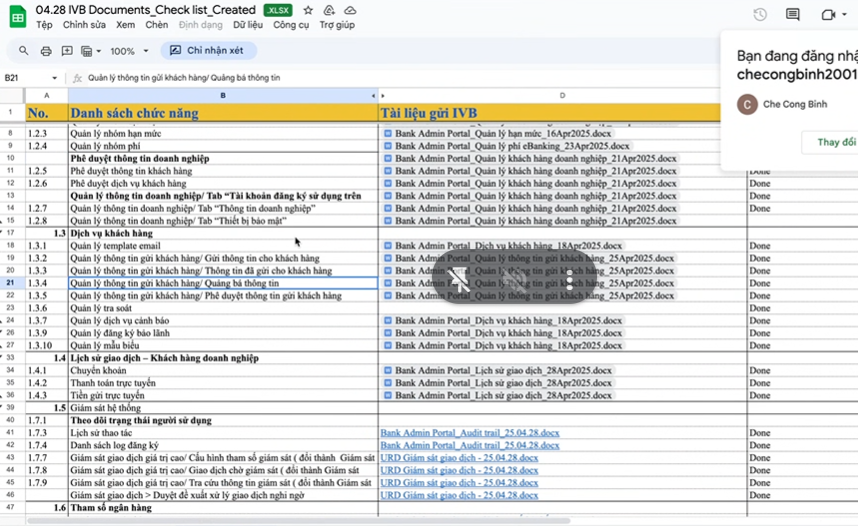

# buổi 1
- chọn dự án: Bookshop
  - quản lý bãi đỗ xe
  - quản lý lịch hẹn bác sĩ

https://youtu.be/ljm-Xy3oYlQ

### các techstack mà senior bắt buộc biết khi làm

OAuth2: mặc định hoặc tự xây
- Git: Hoàn chỉnh (70%) thực tế như bên ngoài làm
- Kafka
- Redis
- Log
- Swagger: open API generator
- CI/CD github/gitlab optional (ko biết có free hay ko)
- ELK: 
  - elactis search
  - Kibana:
  - firebeat
  - Logtash
  - Queue (optional) : dạy theo hướng queue nhưng những hướng khác a sẽ hướng dẫn mình lun
- Gateway: tự xây theo kiểu buổi trước mình học

Dự án 2:
- OAuth2: sử dụng thư viện Keycloak
  - Prometheus
  - Grafana

- Gateway: 
  - NginX
  - KongGateway

- auto fill: xuất file pdf, điền nội dung vào file pdf

- system OTT: là gửi mail, sms, push noti, nó đang cần cục source riêng của mình
- system transaction: 
  - bản chất system là cái project mà tại sao hông gọi là project mà gọi là system này system kia
  - lý do dùng chữ system đơn giản thui vì sau này nó sẽ được dùng để triển khai trên hệ thống khác nữa, chứ ko dùng chỉ 1 chỗ này

### Trước khi vẽ usecase thì cần xác định rõ trước?
- B1: đối tượng sử dụng là ai? actor là ai?
- B2: các tính năng trong dự án sẽ thực hiện?
- B3: đối tượng nào sử dụng các tính năng nào?

### btvn
có btvn để làm luôn, giống thực tế bên ngoài làm, những công nghệ mình làm mình tự quyết định. Trước nội dung ngày hôm sau thì sẽ làm luôn bài tập, xong sửa xong giao kiến thức mới.
- trong các buổi microservice, đưa iu cầu bt mới, kiến thức mới --> xong làm kiến thức mới

### Bước 1: đối tượng nào sử dụng các tính năng nào?
- tức là actor nào, thì có 2 actor: user với admin

### Bước 2: các tính năng trong dự án sẽ thực hiện?
- đăng nhập (nếu ko dành cho user thì cũng dành cho admin)

- bước 2b: thằng nào dùng tính năng nào ghi ra

- xem đ

