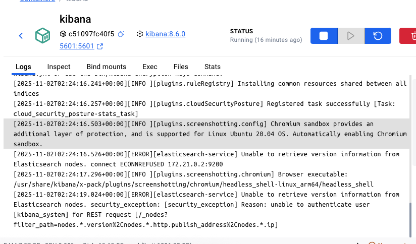
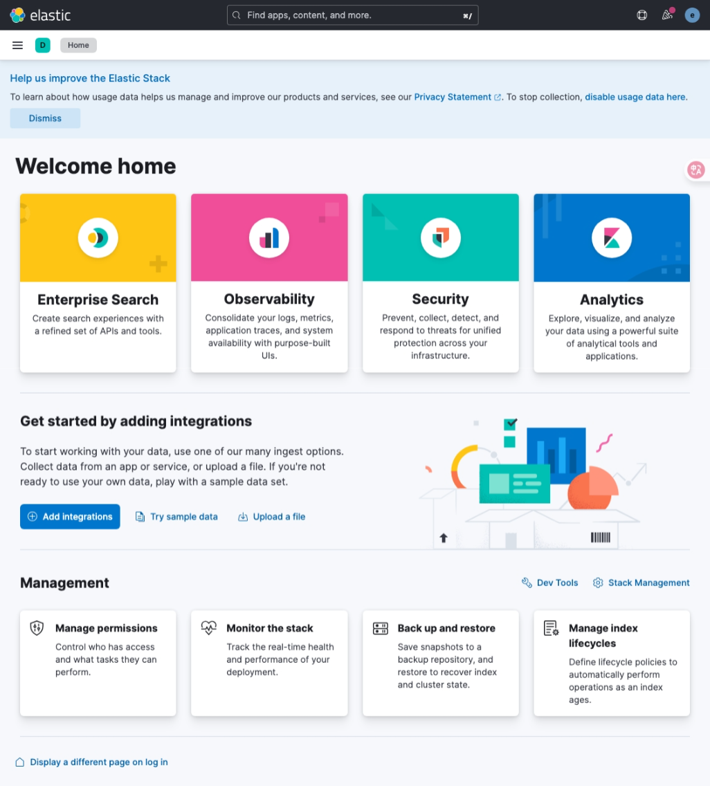
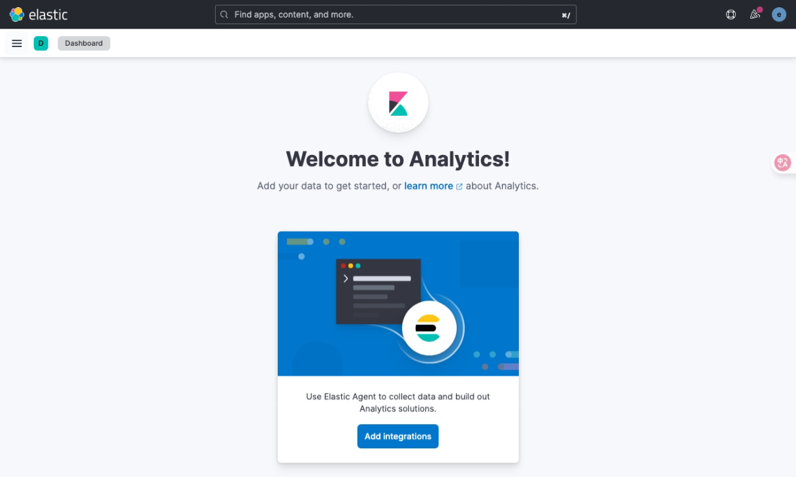

# buổi 20
- cơ chế hoạt động:
  - logtash để đẩy data về elastic search, elastic search nó hỗ trợ api cho việc search log, mỗi lần search tìm kiếm log thì rất khó, cần có người có kiến thức terminal mới search được
  - cần có kibana làm ui để tương tác với elastic search
  - có 2 cách thu thập log, đẩy log
    - fluent
    - firebrick
    - queue, thường dùng con queue để tổng hợp log, chỉ tôns thêm resource thôi, ko tốn gì hết, log tag tốn consumer thôi
    - trunng tâm của elk vẫn là elactic 
    - bây giờ ko có log tash thì có còn là elk, có còn làm được central log ko, mình vẫn làm được, bằng cách gọi api, mình vẫn làm được, mình vẫn xài queue xong đẩy data về sử dụng, người ta đã làm rồi mắc gì mình tự dựng lại
    - elastic search giống như sql, lưu trữ data luôn
  - lộ data password ko sao vì nó triển khai ở tầng private zone

- "./docker-compose.yml" dùng để cấu hình chạy yml
- nó là dr và dc, này anh bình ko dạy nhưng nhớ tim hiểu, mình buộc phải biêt


```cmd
docker compose up -d
```


- ví dụ muốn sửa cái gì đó


- elátic search truy tài khoản ghê lắm
https://www.elastic.co/docs/api/doc/elasticsearch/group/endpoint-security


```cmd
docker compose down
```

ròi

```cmd
docker compose up -d
```
- mới làm elastic: tạo tài khoản mới, đổi username, đổi pass, xong cho super admin

- cái [get role](https://www.elastic.co/docs/api/doc/elasticsearch/operation/operation-security-get-role)

- [change pass có thể change ngay được lun](https://www.elastic.co/docs/api/doc/elasticsearch/operation/operation-security-change-password)

[truy caapj link postman](https://martian-station-399661.postman.co/workspace/Microservice~94a65592-6f6c-47d4-8542-b6d323d2041f/request/38306441-9e6b5cf0-2fd5-4ba4-8e70-3800ad5ca1ed?action=share&creator=38306441&active-environment=38306441-064756a9-eacb-4441-aebd-84799ed6d716)


## kibana

[kibana](http://localhost:5601/app/home#/)



- hỏi anh bình: jenkin cũng giống vậy lun đúng hem?

- ereuka: 


- về solution --> jpa có thể hỗ trợ giải pháp book cùng 1 giờ chính là: lock record, 2 là queue nhưng queue thì kinh quá


- remote_monitoring_collector: cái này quyền xem được, ko sửa được



- vib vs fe --> vib

- mình quan tâm 
- 

- [quan trọng](http://localhost:5601/app/management)

[nó chính là db](http://localhost:5601/app/management/data/index_management/indices)


- đọc logstand
```conf
input {
  kafka {
    bootstrap_servers => "kafka:9092"
    topics => ["logs"]
    codec => json
    security_protocol => "PLAINTEXT"
  }
}
```
- lên trang chủ logtash thấy nó hỗ trợ nhiều input lắm, mún tổng hợp lấy đâu cũng được
- mình xài kafka là hơi bị sai, nó theo hàng đợi, theo thứ tự
- topics mình sẽ lắng nghe lấy data, codec sẽ format về json, và dạng plaintext, để mà lấy data đẩy về, 


```conf
output {
  elasticsearch {
    hosts => ["http://elasticsearch:9200"]
    user => "elastic"
    password => "Aa@123456"
    index => "logs-%{+YYYY.MM.dd}"
  }
  stdout { codec => rubydebug }
}

```

- khi logtash lấy data kafka, lấy data nơi , thông qua filter mình thay đổi dât, thông q àilter có mutate, các field này được hỗ trợ bởi elátic search có cấu trúc hết, nó có thể can thiệt sâu vào mấy này

- input nơi lấy data
- filter nơi lấy data
- output đẩy data về đâu đó lưu trữ gọi là output

- anh sẽ hướng dẫn rabbitmq, khác cách dùng so với kafka còn khái niệm thì y chang


## rabbitmq
- xài dễ hơn kafka nhiều, khái niệm cũng có topic
- nơi quản lý hàng đợi thôi
[rabbitmq](https://www.rabbitmq.com/)
- rabbitmq có ui của mình


```yml
rabbitmq:
    image: rabbitmq:management
    container_name: rabbitmq
    restart: always
    ports:
	○  "5672:5672" # Standard AMQP port
	○  "15672:15672" # Management UI port
    environment:
      RABBITMQ_DEFAULT_USER: user
      RABBITMQ_DEFAULT_PASS: password
    volumes:
	○  rabbitmq_data:/var/lib/rabbitmq/ # Persistent data volume
	○  rabbitmq_logs:/var/log/rabbitmq/ # Persistent logs volume

volumes:
  rabbitmq_data:
  rabbitmq_logs:
```

- xong rồi zô:
http://localhost:15672/