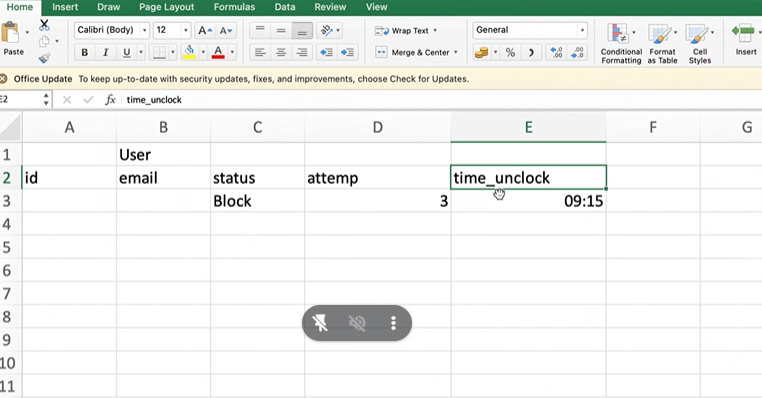
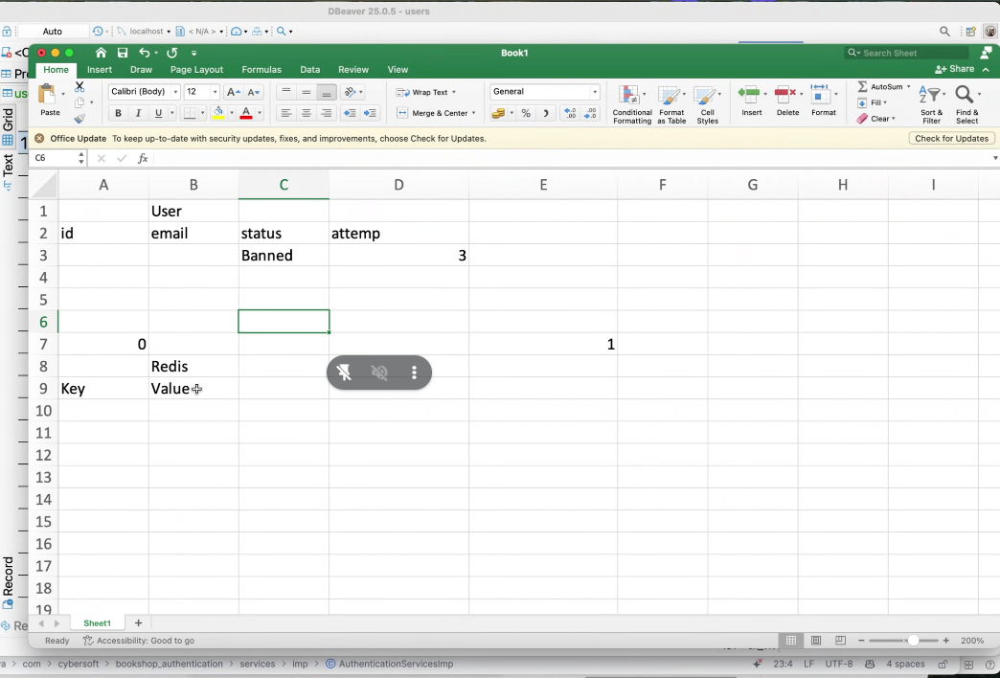
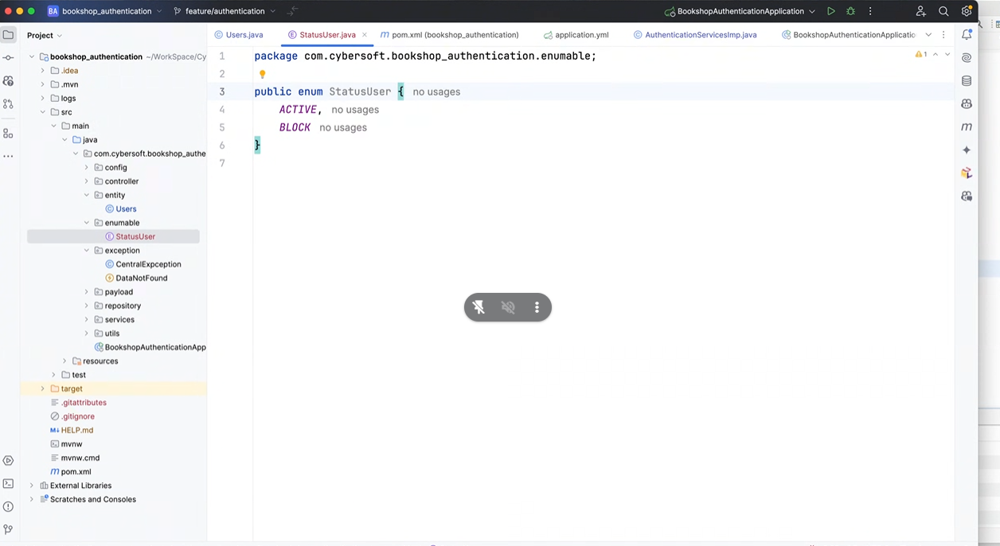
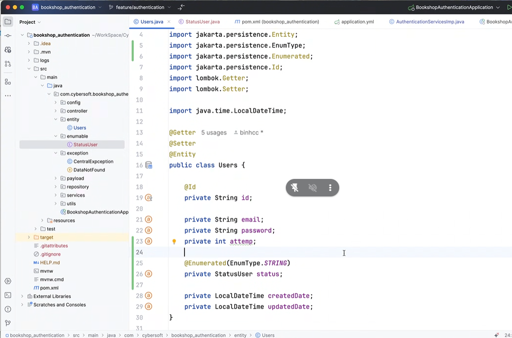
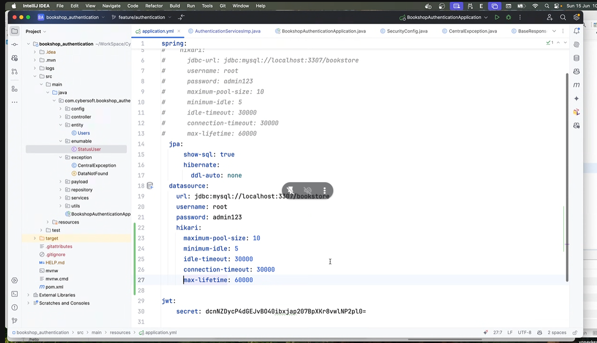
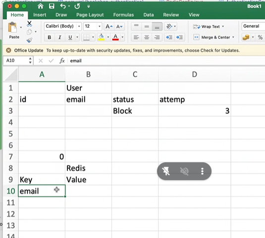

# buoi 5

khi đnăg nhập sai 3 lần, nó sẽ khóa tài khoản 15'?
- làm ntn?

- ko đặt timmer được, vì này là multi - thread chứ hem phải single thread, 
- multi thread là mỗi lần code này vô 1 lần tọa mới timmer 
- single thread 



- redis nó lưu theo dạng key và value,


- 





- nếu mún xài hikaki


```sql
ALTER TABLE users ADD COLUMN status varchar(50);
ALTER TABLE users ADD COLUMN attemp int default 0;
```

```yml
version: '3.8'

services:
  redis-stack:
    image: redis/redis-stack:latest
    container_name: redis-stack
    ports:
      - "6379:6379"     # Redis port
      - "8001:8001"     # Redis Stack web UI
    volumes:
      - redis-data:/data
    restart: unless-stopped

volumes:
  redis-data:
```



- vnpay giair phasp db
- còn bank xài cách này

- GRPC, Restful api
- 