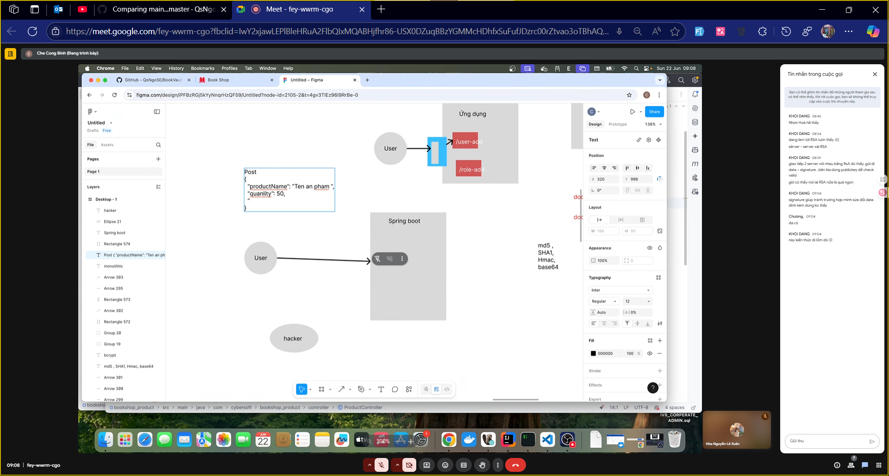
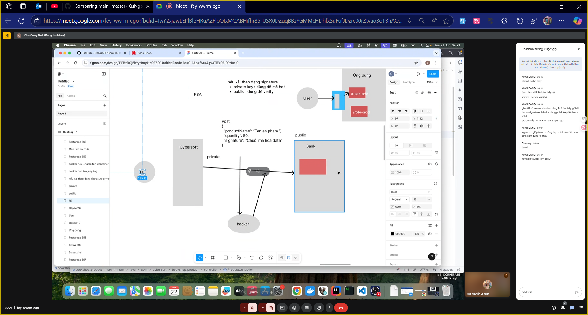
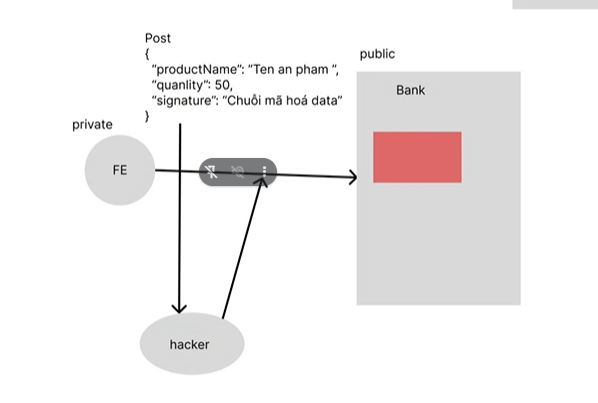
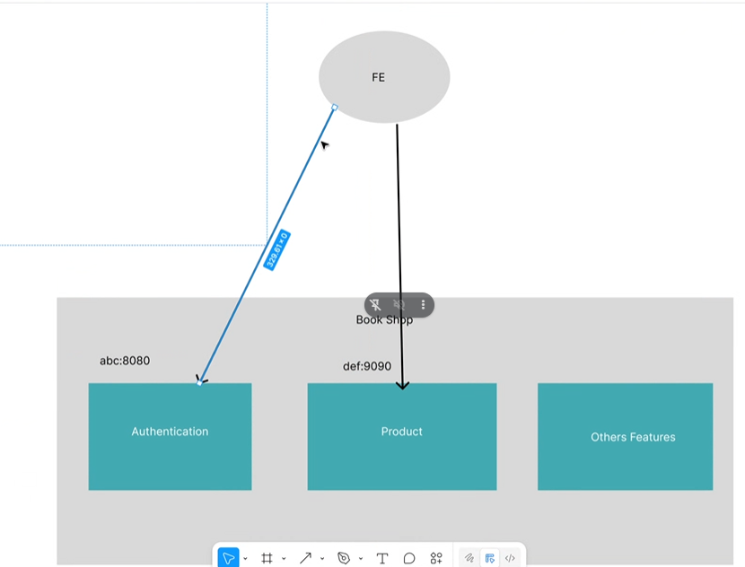
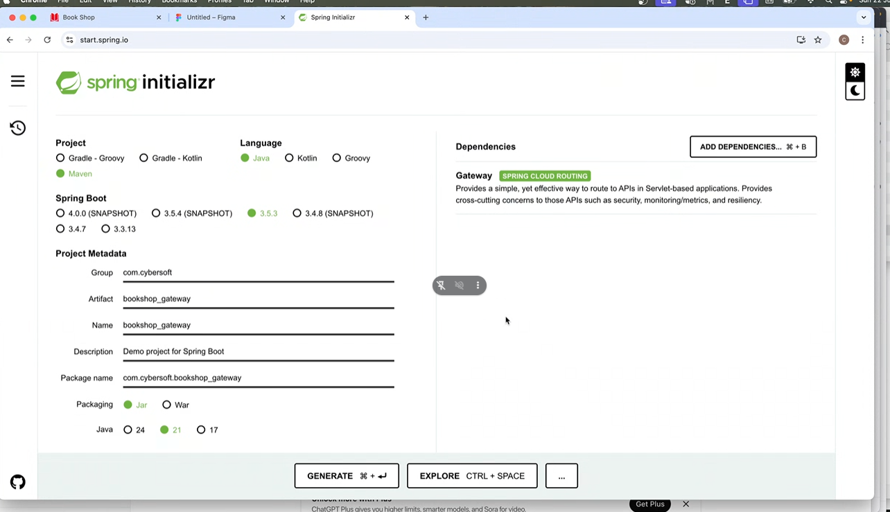
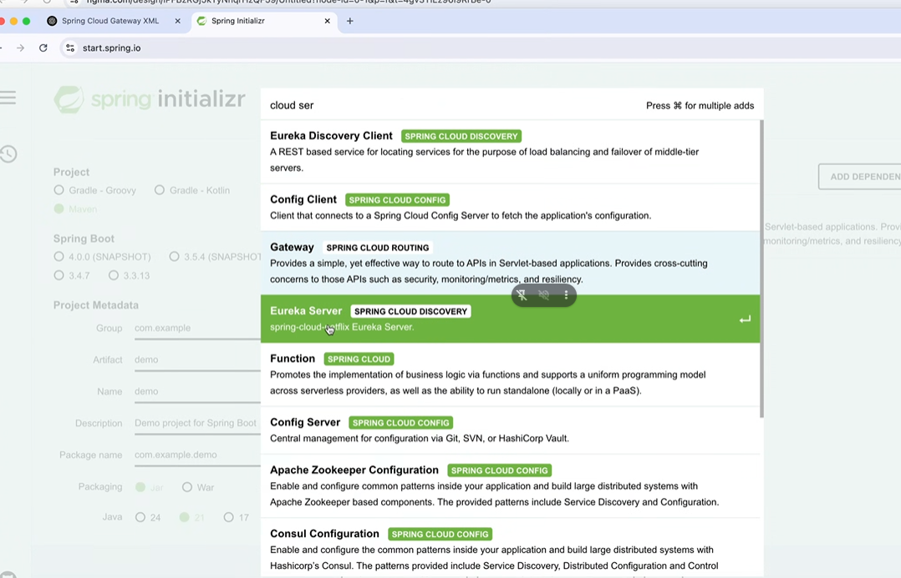

# Buổi 6

- hôm nay hem típ tục redis
- khóa này chuẩn bị mã hóa chuẩn rsa

- ko chuyển sang onion design pattern vì nó phù hợp cho microservice dạng monolitic, vẫn chia module nhưng nó ko gọi là project riêng rẽ mà nó gọi là module thì nó chỉ phù hợp khi làm 1 ngôn ngữ hoy, dẫn đến nó ko phù hợp, và nó xài signature.
- nên là mình vẫn giữ mô hình cũ, ko switch qua mô hình design pattern

- giải thihcs vụ signature
  - anh Bình giải thích là Post có truyền lên ví dụ:
Post
```json
{
  "productName": "Tân sản phẩm",
  "quantity": 5
}
```


- hacker có khả năng can thiệp gói tin và sửa gói tin, vậy nên đi kèm chuỗi mã hóa data 
- rsa dùng để làm signature hoặc mã hóa data
- rsa nếu xài dạng signature thì 
  - private key nó sẽ dùng để mã hóa, 
  - còn public key dùng để verify



- public key có nhịm vụ verify, cần gửi mail public key, front-end ko có đonạ code sinh ra key, đoạn code backend sinh ra public key private key

- giải thích vì signature:
  - tính toàn vẹn dữ liệu
  - 

### hỏi anh Bình:
  - bữa a bảo anh gửi hikaki chạy được á anh
  - cái zụ database lưu phiên bản
    - 


### gateway

- giải vấn đề 1 con fe gọi quá nhìu cổng

- vậy nên mình cần con đứng giữa là gateway
- mà con gateway bên mình nhìu lứm ví dụ :
  - nginx
  - api management
  - esb
  - gateway
- tùy vào tính chất sẽ xài những con tương ứng
- gateway thường phải tự code chứ ko đặt con 
- cicd xài github gitlab ko xài jenkin




- chatgpt: phải đưa ngữ cảnh zô trước, có nhìu gateway nó ko biết được, nên phải đưa context trước
- I  use spring boot and spring cloud gateway, và hỏi nó làm cách nào để làm, with xml?

## BTVN:
- về nhà tìm hỉu và thế tên localhost = service name:




- với chạy lại cục source bằng webmvc mới

## bữa sau học:
- giap típ giữa các server

## mốt:
- spring clould config
- 