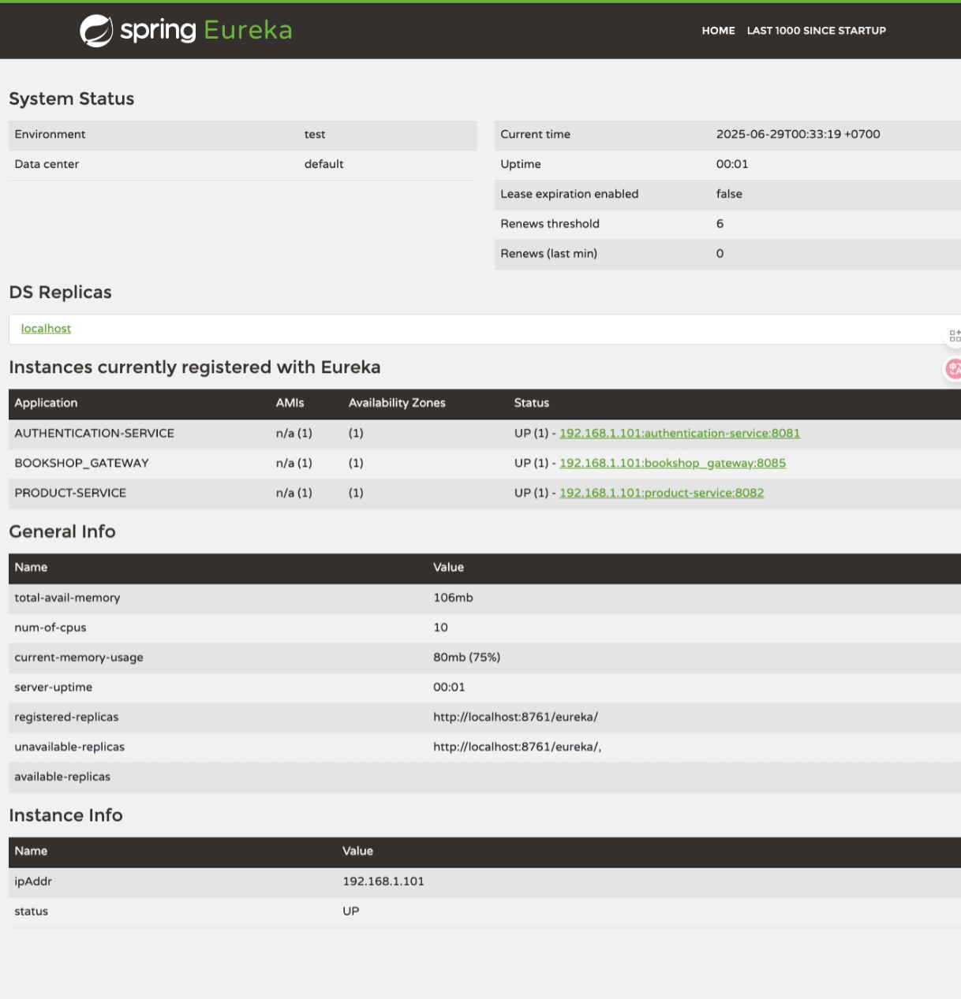
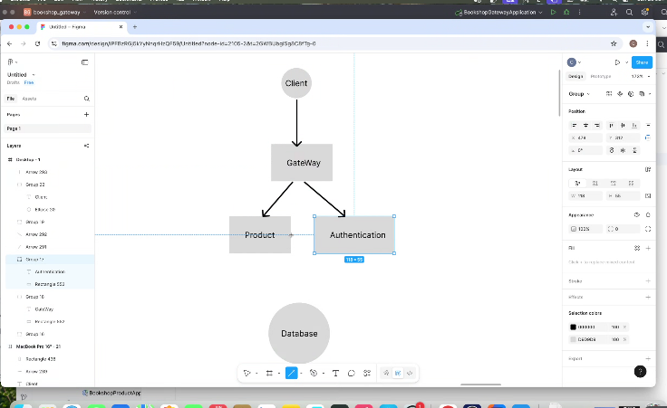
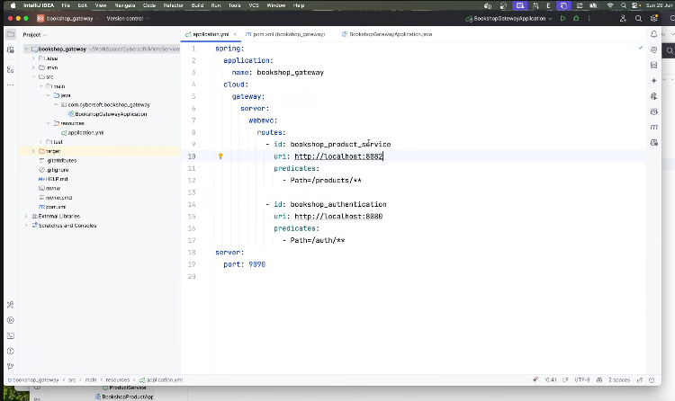
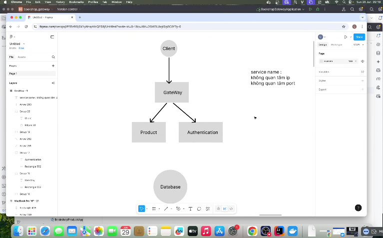
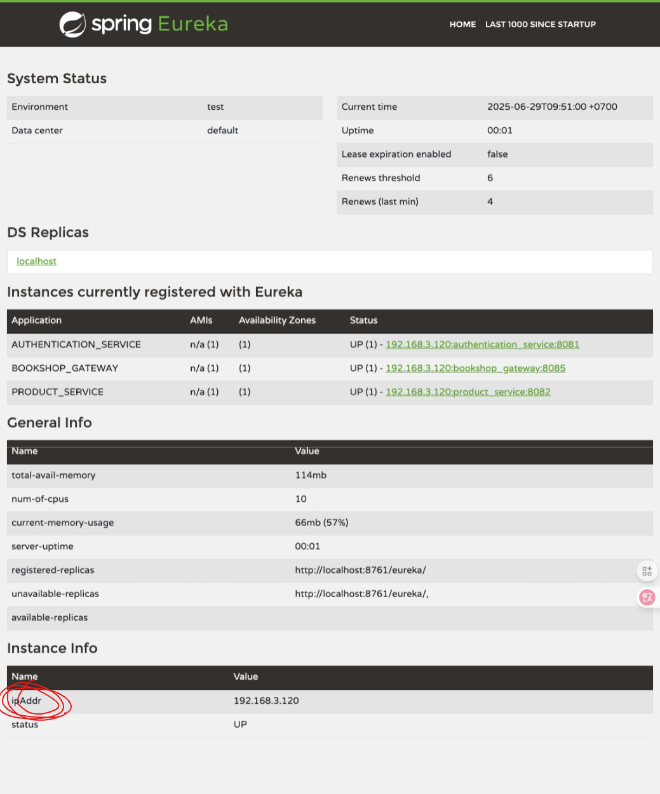
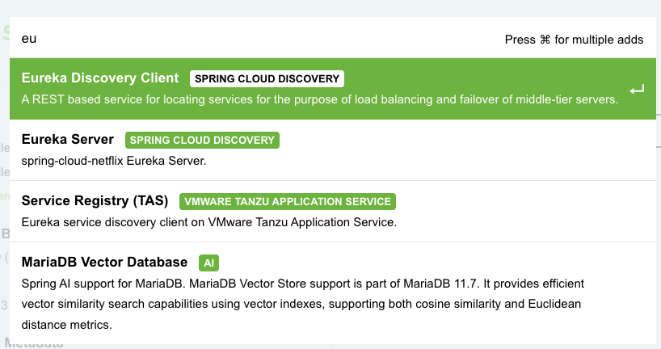
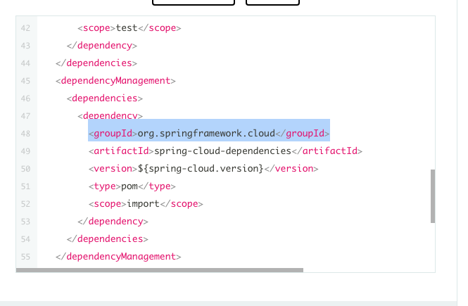
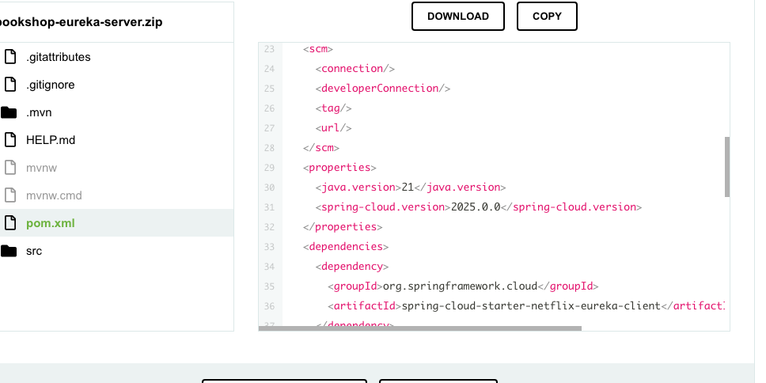
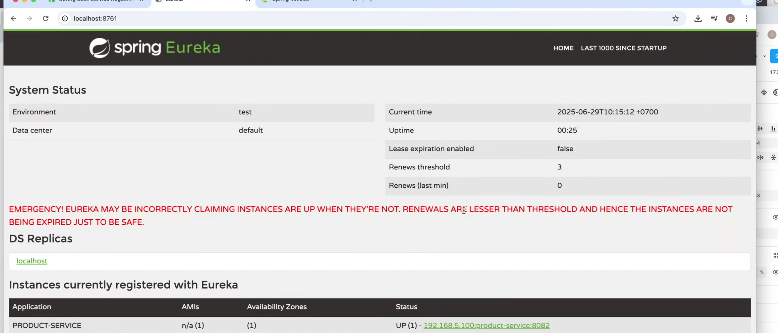
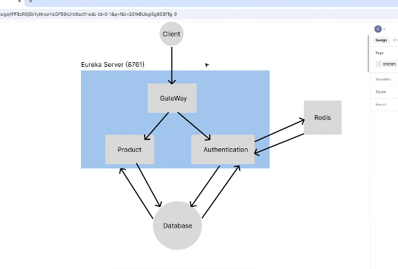

## btvn đã làm


# buổi 7 euraka server

- bene frontend người ta mún dùng duy nhất một đường dẫn để người ta forard duy nhất một cái thui, để forward một đường duy nhất qua 






- mà thằng dev óp đổi server nó méo chịu báo cho mình biết, mà mình chia nhỏ source rồi mình rất khó control, mà các con service đang cần giao típ với nhau, ví dụ con gateway gọi tới product, hoặc product gọi tới authen.
- mình sẽ ko cho nó giao típ bằng ip nữa mà mình cần một cái giống như domain của mình, chính là service name, lợi thế là ko cần quan tâm ip và port, chỉ chú trọng vào tên của service của mình thôi

- này nó khá giống khái niệm của domain
- có 2 cách setup:
  - 1 docker
  - 2 eureka server:
    - giống như mình tạo cho nó ngôi nhà, tạo cho nó khái niệm trên môi trường network, giống như bỏ trong một ngôi nhà, xong mấy cục service này bỏ vô trong ngôi nhà, xong mình đặt tên phòng giống như đặt tên phòng trong ngôi nhà, cái ngôi nhà bên ngoài gọi là zone theo khái niệm mạng, mình tạo ra một cái phân vùng, mình sẽ đặt mấy con này trong một phân vùng mạng, thì trong cùng mạng thì cùng ip luôn, chỉ khác cái port hoy
    - cái zone này được gọi là euraka server, mình mún dùng thì mình đăng kí eureka server, nó sẽ chừa 1 phòng cho thèn gateway đi zô, thèn product cũng vậy, khi cần 1 phòng thì sẽ đăng kí để được zô eureka server, nó chỉ sử dụng cho cục spring boot, các nggon ngữ khác sẽ xài khái niệm khác.
    - link hướng dẫn: [tutorial point](https://www.tutorialspoint.com/spring_boot/spring_boot_eureka_server.htm?fbclid=IwZXh0bgNhZW0CMTEAAR6iA5f4MsHHDciV5D0ujem8s1J5sC2-wIq-mPjOStwAbPQ79l4EOkBJx5l-Xg_aem_al6i9Tivtz2aCurWQOLWwg)
## các bước chạy eureka:
- bookshop-eureka-server:

- xài gạch dưới
```yml
spring:
  application:
    name: bookshop_eureka_server
server:
  port: 8761

eureka:
  client:
    register-with-eureka: false
    fetch-registry: false

```



- những service nào mún đăng kí service name làm con client thì xài cái ni



- nhớ copy cái cục dêpendenci managerment, copy cái ni thì nó mới đăng kí spring cloud


- xong kéo lên xíu thấy chữ property thì copy nó, để lấy đc biến môi trường
- cái spring cloud nó sẽ đồng bộ tất cả version của thằng nào dùng spring cloud


- sửa thằng mac bị ko ctrl space ra được gợi ý

