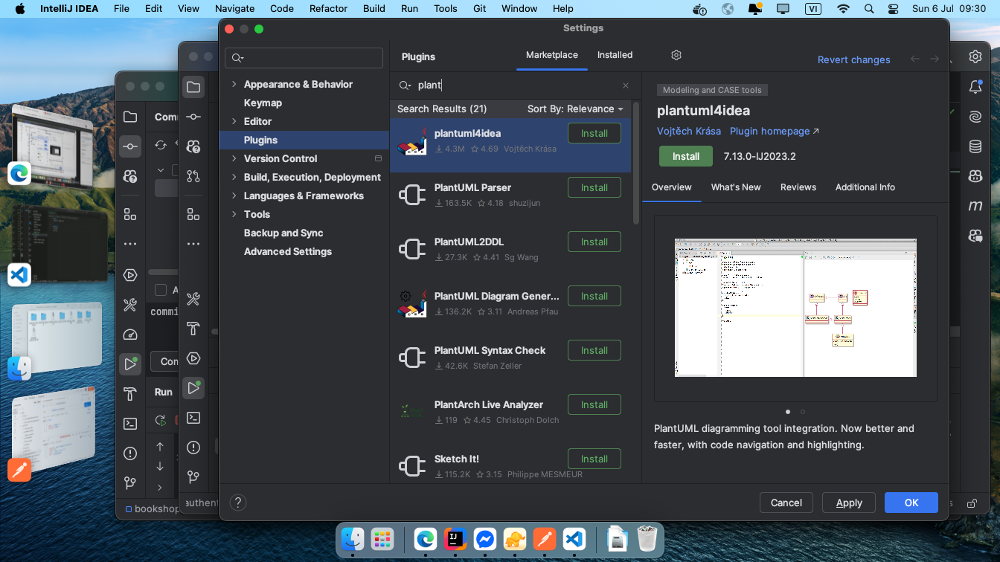
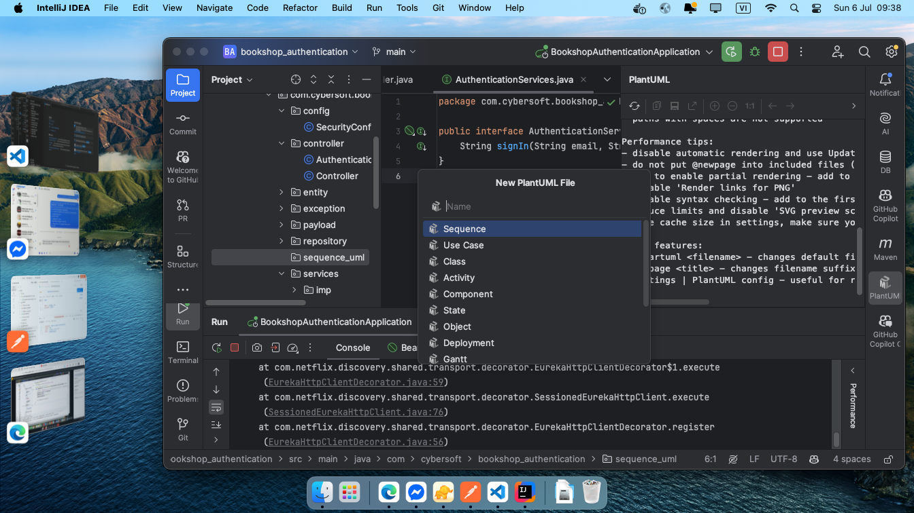
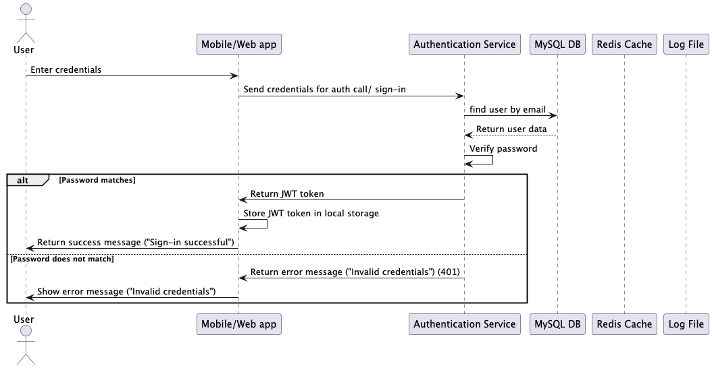

# buổi 8
- login các luồng ntn?
  - 

- cần cài cái này


- tạo thư mục plain uml, xong đặt tên file ứng với tên controller của mình, ví dụ controller là sign in thì đặt tên sequence sign in
- xoá đi còn cái rỗng
  
```puml
@startuml

@enduml
```

- chatgpt
```
 I use ajax jquery, help me call api 
const axios = require('axios');
let data = JSON.stringify({
  "email": "hoa@gmail.com",
  "password": "123456"
});

let config = {
  method: 'post',
  maxBodyLength: Infinity,
  url: 'localhost:8081/authen/sign-in',
  headers: { 
    'Content-Type': 'application/json', 
    'X-API-Key': '{{token}}'
  },
  data : data
};

axios.request(config)
.then((response) => {
  console.log(JSON.stringify(response.data));
})
.catch((error) => {
  console.log(error);
});

```
## buổi sau
- quên mật khẩu
- gửi mail
- gửi otp

## btvn
- gửi mail