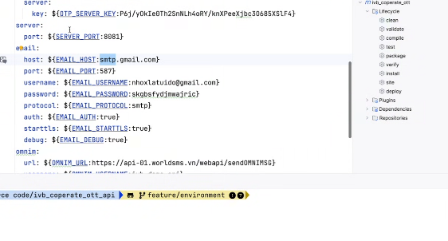
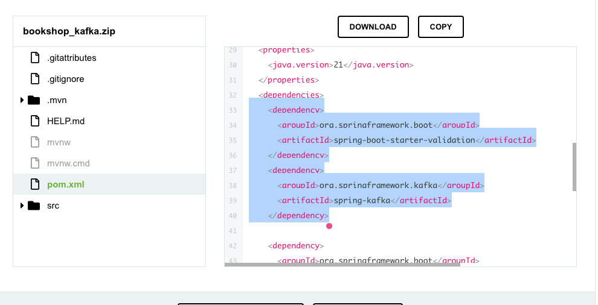

# buổi 9
- làm cái login hay gì đó chưa nghe rox lắm

mình xài cái gmail này test 
- khi có đầy đủ tính năng server gửi mail 

- phải đặt ra câu hỏi tính năng này cần phải liền ko, có quan trọng ko, chỗ này nó ko nhất thiết phải liền thì có thể 

- tải cái docker-compose.yml
- docker compose up -d
- xong mở 
```cmd
localhost:8085
```
- kafka:
- link: https://www.tutorialspoint.com/spring_boot/spring_boot_apache_kafka.htm?fbclid=IwZXh0bgNhZW0CMTEAAR5LXfbcefRUAZTNBEAajQLZRUQZymy5E48HL0UvAjTtJqJX7LscMAaQOMpbZw_aem_pJdY7LYXut3V6YD2luncOQ

- 
```xml
    <dependency>
      <groupId>org.springframework.boot</groupId>
      <artifactId>spring-boot-starter-validation</artifactId>
    </dependency>
    <dependency>
      <groupId>org.springframework.kafka</groupId>
      <artifactId>spring-kafka</artifactId>
    </dependency>
```
- mình đang đẩy data kafka mình là producer


## btvn
- tự tìm hiểu volume
- gửi email luôn
- làm cái này trước để kịp làm mô hình, để đk stmp email, cần phải đk này trước vì nó hơi take time
https://www.youtube.com/watch?v=mAoQ2voEev0