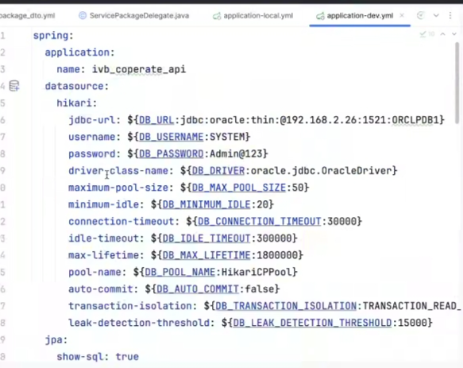
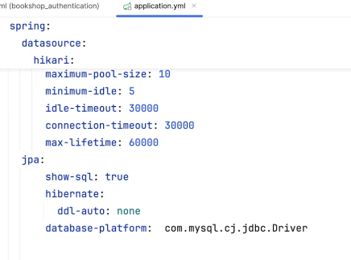
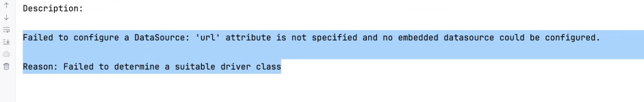
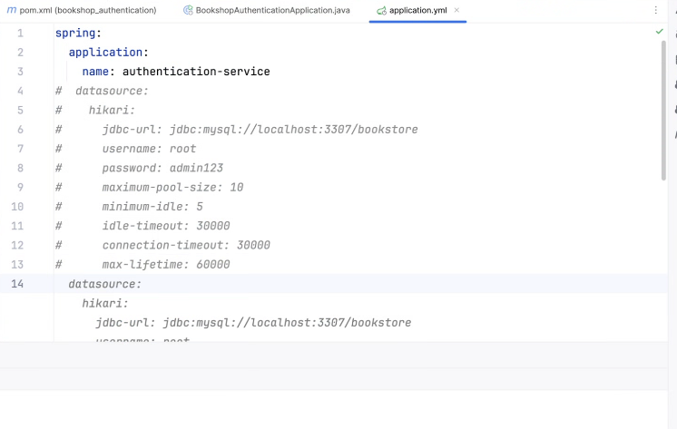
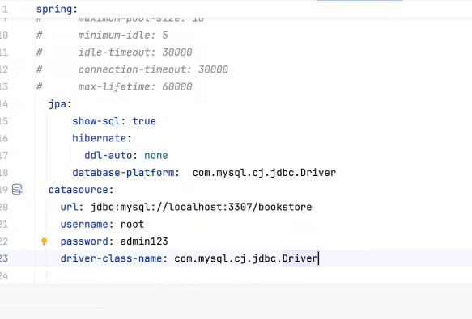
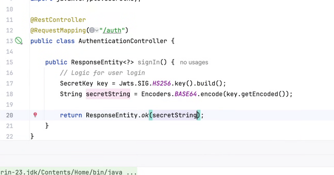
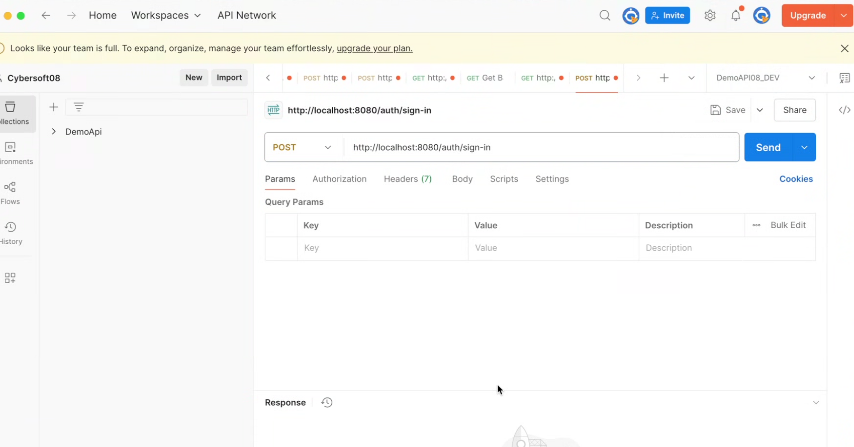
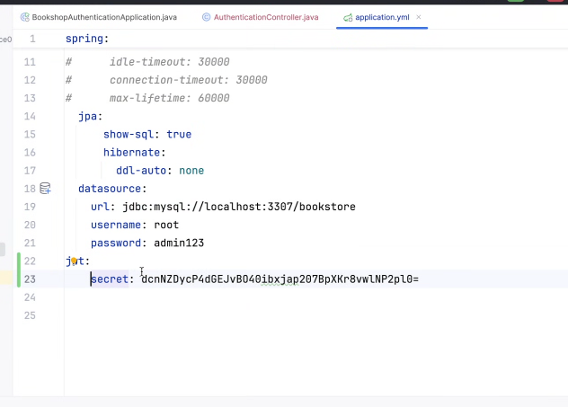
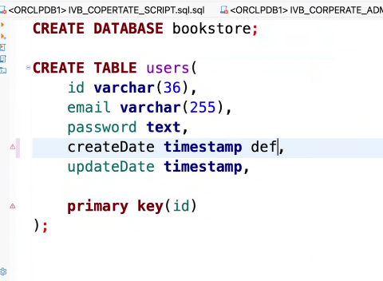
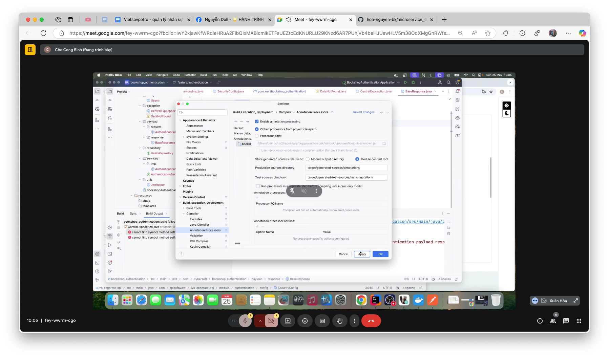

# buoi 2
https://youtu.be/ljm-Xy3oYlQ

nhớ cài hết rồi mới start

- cái dấtource jdbc thì nó ko hỗ trợ cấu hình dâtabase
- cái datasource hiraki cài cái ni zô, cái naỳ hỗ trợ cấu hình tốt hơn
-  


- thư viện cần cài:
  - jjwwt
  - mysql driver
  - hình như có api nữa, coi cái thư mục cùng tên xem có cái đó hem

- xong cái bữa ông anh đưa tui quên phân tích database theo, mà tui phân tích database theo cái cũ mới chán



- Cái hikari:
    - cái minimun - idle cái maximun đợi, cho phép tối đa 5 chiếc xe đợi, quá 30000 giây chưa lưu thông được thì cho nó ra khỏi hàng đợi lu
    n
    - connection timeout tự động truy vấn database quá lâu thì nó mucxs connection timeout 30000 giây thì nó sẽ ko chiếm database nữa
    - mấy thuôjc tính này lên chatgpt search thì nó sẽ khá chỉnh chu

    - nhớ đặt tên ứng dụng, sau này làm microservice nó sẽ đặt tên đúng dụng
    - nó có thuộc tính driver class name thường là vậy
    - 










https://github.com/checongbinh20011990/bookshop_authentication

hồi xưa tạo repo trên git, nó bắt mình đồng bộ nhánh bằng câu lệnh
```
 git branch set up ỏigin nhánh gì gì đó của git gợi ý 
```

- đồng bộ nhánh duới local và nhánh trên remote

- xong ông anh tách nhánh ra

- tạo 3 thư mục: controller, repository, service
- tạo xong thì cần tính năng login, thì nó mới cần tới jjowt của bọn mình
- tạo AuthenCOntroller
- Nhớ thêm RestController, RequestMapping (với chữ auth)






- lưu cái key


- anh tạo cái package util để lấy jwt nhìu chỗ
- đưa lên ioc bằng cách dùng @Component: 


- trường phái làm tới đâu phân tích tới đó chứ ko làm database trước, trường phái senior, ko phản tích databse từ đầu mà lamf tới đâu phân tích tới đó, nó đang kiểu iu cầu ba chưa có phải chạy dự án xong xong, nên mình chưa có cái nhìn tổng quan về db mà mình phân tích theo nghiệp vụ hiện có thôi
- xong giờ anh sẽ hướng dẫn các bạn làm id dạng khác - uuid
  - dùng kiểu int thì tới 2 tỷ record là hết, vơis ko bảo mật user, có thể search ra user dễ dàng chỉ bằng cachs seảch cái số int là ra
  -  
  - để cái này để đồng bộ vơis các database khác vì nó sẽ ko tự động tăng, mình sẽ làm tự động trtawng
  - email là tên đăng nhập
  - passord sử dụng kiểu text vì mình ko biết bscrypt xài tới bao nhiêu kí tự nên cứ auto là text


- bổ sung loombook, hiện tịa đâyf đủ con hàng import


- khi mà bị lỗi import thư viện bị mất lômbook thì chỉ cần add đoạn coder này sẽ ko bị mất lombok nữa

- xong tạo entity của user xong ánh xạ
- với date anh xài localDatatime, 
- nhớ đúng quy tắc, viết hoa chữ cái đầu thì nó sẽ kiếm tên _ để map cho đúng
  - ví dụ: createdDate thì trong databse thì phải created_date trong database
  - 
- Bước 3: xong cái entity sẽ đến repo,. userRepositoy
- bước 4: xong tới thèn service
- Bước 5: xong tới thèn impservice
- Bước 6: thèn controllder
- Bước 7:xong nhớ toạ thằng payload, 1 cái requét 1 cái response
  - Tạo cái authenRequét xong bắt ngừi ta truyền 2 tham số email + pass
  - xong lấy email pass kiểm tra coi có tồn tại trong db ko, nếu tồn tại thì trả token cho họ
  - do mình ap dụng pas là bscrypt, nên ko thể dùng email và pass đc mà bắt buộc phải lấy theo email
- b8: zô cái service tạo hàm sign in tham số nhận vào là email và pas
- b9: zô cái imp: vơis hàm sign in, zô cái autowrited để lấy thèn jswt hellper
  - xong qua thèn thứ 2 user repository,
    - xong bây giờ viết hàm truy vấm qua emai ở thằng repositoty
    - ãong áp dụng thằng optinal, nhớ rằng optional được áp dụng khi dữ liệu câu truy vấn chỉ trả ra 1 record, vì database email là duy nhất, nên chắc chắn ko sợ bị trùng, thì mới xài được optional
    - xong bây giờ xài userRepo. findByEmail, nếu mình lừoi mình mún ở phần imp mình trả về orElseThrow, nhớ tạo lỗi handle Exception, new RunTimeError thì ko biết đó là lỗi gì, nên mình cần handle lỗi ở đâu, để trả mã lỗi đàng hoàng
      -  tạo cái thư mục exception, tạo CenterException,  1 hàm để hứng exception
    -  
      -  nhớ taọ thêm cái basereponse, 
      -  đăng nhập thất bại trả lỗi  400, sai tham số, hoặc 403 đại diện cho việc chưa chứng thực đăng nhập
      -  là cái httpStatus.UnAuthorizeds 
      -  
      -  và nhớ thêm cái @Ecxeiton là cái RuntimeExeption, khi tạo ra lỗi RUntimeExxception, 
      -  nhưng bên ngoài khi tạo ra exception có nghĩa mình cần tạo ra, mình cần tạo ra exception tên ví dụ như là DataNotFault trong thư mục exception
      -  
      -  ảnh tạo 1 cái exception ví dụ cho mình lun trong file đó, chỉ cần tạo cái class, đặt tên cho nó có nghĩa, kế thừa runtime, 
-  B10: tạo config
   -  xài chuẩn bscrupt, phải add thư viện security
   -  
   -  
   -  
   -  
   -  nhớ ném lỗi ra, trả cái token, ggọi hàm sinh token, truyền cái email zô, 
   -   cái hàm signin vì trả về token dạng string nên hàm bên service nó tcũng trả về kỉêu string trong service lun
   -   nếu 
   -  
   -  
-  bênm postman tạo workspace authen
   -  lưu dạng authen sighn in 
   -  thêm data zô postmen zô trang bscript online tạo 1223456
   -  pass ra nhưng uuid chưa có mình lên trangh uuuid online generator, xong truyền zô
   -  tạo được user thông tin đăng nhập mới
   -  xong bên postman nhớ nhập email và pass 123456
   -  
-  task sign in này middel: 3 tiếng, senior 2 tiếng, fresher 3 ngày
-  xong bây giờ ảnh mới push
-  khi mà mình làm xong là ảnh có sql là nó zô git
-  

- coi cái file log.txt của a bình
- chỉ cần tỏng spring boot đặt đúng tên file nó sẽ tự động log zô file
- nhớ đặt đúng tên bookshop_authen .log vì mình xài microservice

bữa sau:
- học cách giao tiếp 2 cục source microservice
- hông có btvn
- xong gọi tơis cục source authen
- product truyền token cho cục auten nhờ veryfi dùm, xong 2 cục source auth với produce ggiao tiếp ntn
- 