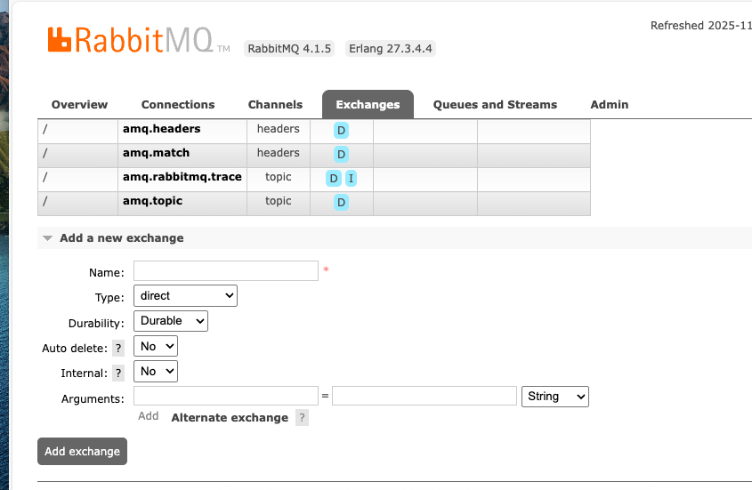
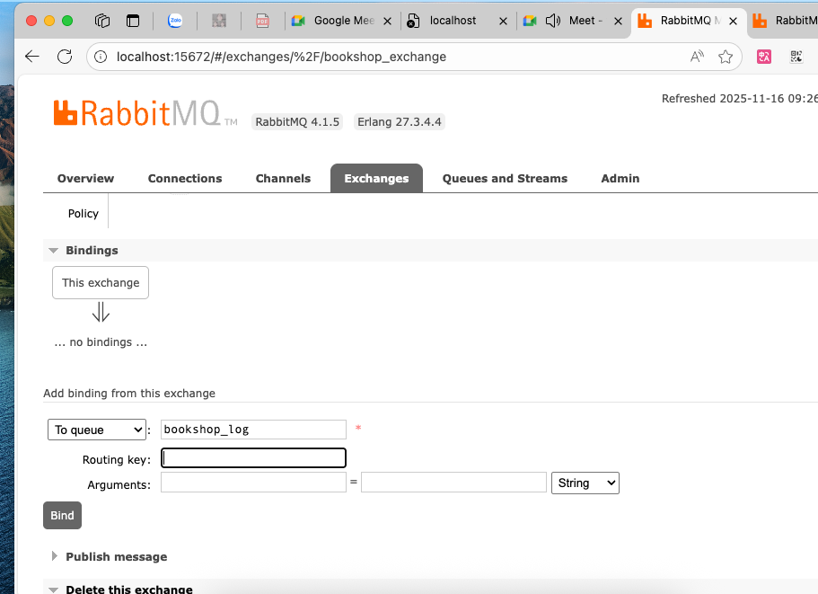

# buoi 21

https://www.vietnamworks.com/chuyen-vien-cao-cap-quan-ly-du-an-tmo-1964550-jv


https://piotrminkowski.wordpress.com/2017/02/03/how-to-ship-logs-with-logstash-elasticsearch-and-rabbitmq/?fbclid=IwZXh0bgNhZW0CMTEAc3J0YwZhcHBfaWQPNDM3NjI2MzE2OTczNzg4CGNhbGxzaXRlAjI1AAEelIyuPxL57Yp5dHOSBoRlsj3zxOhC20R9UjOZmcj_wvoLWm_tqVB5NHv7ujE_aem_hCJZ4_4_koCnVg-K7BbtfA

- nếu data ko lưu theo thứ tự, file

- trace xuyên index: để khi điền request id zô, 

- chaỵ docker compose cái này /Users/hoanguyenlexuan/Documents/java08/microservice/microservice_08/buoi20/docker-compose.yml

- tạo quêu mới


- lưu trên ram là transiant
- lưu trên file là durable, ghi thành file để lưu




- click "bind"


- để ko bị lỗi version lombok, chỉ cần search xem véion của lombok bỏ zô là được


- nó khai báo lỗi thôi chứ chưa lỗi in tam, nhớ check đúng port rabbitmq
- gốc, trên link nga:
```xml
<appender name="AMQP" class="org.springframework.amqp.rabbit.logback.AmqpAppender">
    <layout>
        <pattern>
            {
            "time": "%date{ISO8601}",
            "thread": "%thread",
            "level": "%level",
            "class": "%logger{36}",
            "message": "%message"
            }
        </pattern>
    </layout>
 
    <!-- RabbitMQ connection -->
    <host>192.168.99.100</host>
    <port>30000</port>
    <username>guest</username>
    <password>guest</password>
 
    <applicationId>api-service-4</applicationId>
    <routingKeyPattern>api-service-4</routingKeyPattern>
    <declareExchange>true</declareExchange>
    <exchangeType>direct</exchangeType>
    <exchangeName>ex_logstash</exchangeName>
 
    <generateId>true</generateId>
    <charset>UTF-8</charset>
    <durable>true</durable>
    <deliveryMode>PERSISTENT</deliveryMode>
</appender>
```
- sửa trên file minhf:

```xml
<configuration>
    <appender name="AMQP" class="org.springframework.amqp.rabbit.logback.AmqpAppender">
        <layout>
            <pattern>
                {
                "time": "%date{ISO8601}",
                "thread": "%thread",
                "level": "%level",
                "class": "%logger{36}",
                "message": "%message"
                }
            </pattern>
        </layout>

        <!-- RabbitMQ connection -->
        <host>localhost</host>
        <port>5672</port>
        <username>user</username>
        <password>password</password>

        <applicationId>api-bookshop-authentication</applicationId>
        <routingKeyPattern>bookshop</routingKeyPattern>
        <exchangeName>bookshop_exchange</exchangeName>

    </appender>
    <property name="LOG_PATH" value="${LOG_PATH:-./logs}" />

    <appender name="STDOUT" class="ch.qos.logback.core.ConsoleAppender">
        <encoder>
            <pattern>%d{yyyy-MM-dd HH:mm:ss} %-5level %logger{40} - %msg%n</pattern>
        </encoder>
    </appender>
    <appender name="FILE" class="ch.qos.logback.core.rolling.RollingFileAppender">
        <file>${LOG_PATH}/bookshop_authentication.log</file>

        <!-- Use SizeAndTimeBasedRollingPolicy for daily logs with a 200MB size limit -->
        <rollingPolicy class="ch.qos.logback.core.rolling.SizeAndTimeBasedRollingPolicy">
            <fileNamePattern>${LOG_PATH}/app.%d{yyyy-MM-dd}.%i.log.zip</fileNamePattern>
            <maxFileSize>200MB</maxFileSize>
            <maxHistory>30</maxHistory> <!-- Retain logs for the past 30 days -->
            <totalSizeCap>2GB</totalSizeCap> <!-- Limit total log storage to 2GB -->
        </rollingPolicy>

        <!-- Log output pattern -->
        <encoder>
            <pattern>%d{yyyy-MM-dd HH:mm:ss} [%thread] %-5level %logger{36} - %msg%n</pattern>
        </encoder>
    </appender>

    <root level="INFO">
        <appender-ref ref="STDOUT" />
        <appender-ref ref="FILE" />
        <appender-ref ref="AMQP" />
    </root>

</configuration>
```

```bash
2025-11-16 09:42:08 INFO  o.s.c.n.e.s.EurekaAutoServiceRegistration - Updating port to 8081
2025-11-16 09:42:08 INFO  c.c.b.BookshopAuthenticationApplication - Started BookshopAuthenticationApplication in 2.488 seconds (process running for 2.965)
2025-11-16 09:42:08 INFO  com.netflix.discovery.DiscoveryClient - DiscoveryClient_AUTHENTICATION_SERVICE/192.168.3.110:authentication_service:8081 - registration status: 204

```
- là thành công 1 bước
- http://localhost:15672/#/queues
- xong nó lên được >10 cái là xong