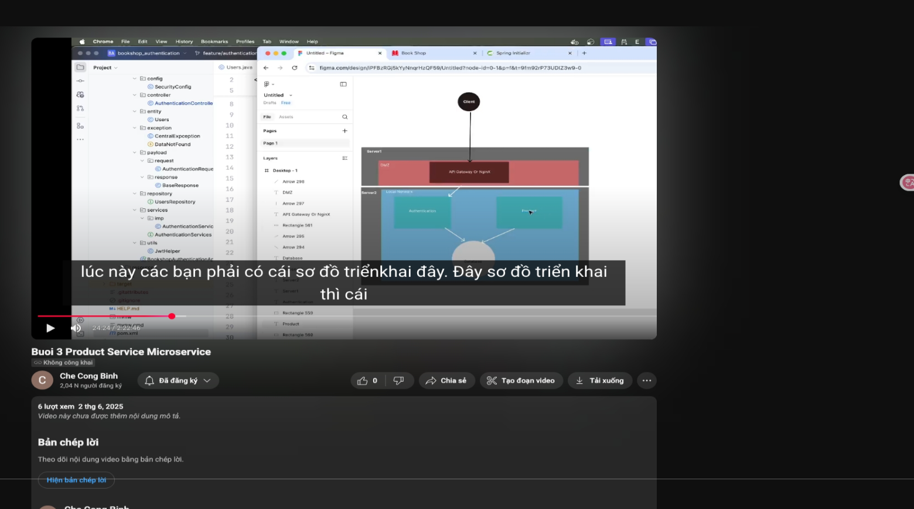

# buổi 3
- nếu microservice xài 1 version node thì xài chung mấy cái khác version đó lun
- tất cả e commerce, sách áo quần gì đều xài chung 1 từ product trên db trên source luôn, sau này cầm cục này copy qua cho nó dễ

- phân vùng mạng để truy cập zô bên trong nó khó khăn, nó sẽ phân vùng mạng, để cho phép bên ngoài gọi zô cái gateway, dùng khái niệm dmz

- chỉ có con server 1 gọi đêns con server 2 thôi

# dùng chatgpt
https://grok.com/share/c2hhcmQtMg%3D%3D_b9d8a622-ae4b-4b82-8def-be26b245ec1b

theo hướng hỗ trợ thôi xong bắt buộc phải kiểm tra lại, xem thử xem
- đúng entity chưa, đúng repo chưa, cú pháp khai báo đúng chưa

- please explain logic code detail for me

- lấy danh sách sản phẩm product rồi, mình được product entity --> nhưng mình ko trả cái product entity ra ngoài được mà nó phải biến về product dto, thì nó sử dụng hàm map

- mình coi coi chatgpt có làm đúng cái luồng mình mún follow ko
- mình có cái thèn mapped để map từ dto sang entity, entity to dto, gọi thèn map để map từ entity sang dto, 

- refresh token: truyền lên để lấy token mới thôi, ko cần bảo mật, về cơ bản cách sinh là như nhau

## BTVN:
- về nhà tìm hỉu cách cài extension cọpilot, vì nos tốn tânj 5 phút
- làm cách nào đó tái sử dụng entity cho các project khác nhau, nhớ vèe nhà tự tìm hiểu nhennnnn
- mô hình onion design pattern: top đầu trong mô hình design pattern, còn statèies là top 2 thui, còn top đầu là cái onion này
- flyaway: khi nào code firrst thì xài flyaway, tự động map từ database sang cái entity trong code, nhưng mà mình sẽ cố gắng tujw viêts trước cho nó quen
- có phải tạo folder mapper để chứa mấy hàm map ko thầy: có thư viện mapstruct để can thiệt mí cái dto, setup hơi mệt, sau này 

- chatgpt của a bình

https://chatgpt.com/share/683bc5b3-1bc4-800c-8775-87710d22d5ab
